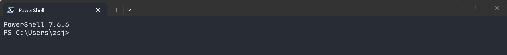

# 前置工具

本教程的 npm 安装路线使用同一套基础环境。其他原生安装方式不一定需要 Node.js。**这份文档只要做一次**，做完之后再去看具体的工具文档。



---

# 0 一页清单

| 要装的东西 | 用途 / 是否必需 | 怎么装 |
| --- | --- | --- |
| **Node.js ≥ 22.19** | 四个工具都用 npm 安装 | [第 1 节](#1-nodejs) |
| **Git for Windows** | pi / OpenCode 用它执行命令；Claude Code 的 hooks 也依赖它 | [第 2 节](#2-git-for-windows) |
| **Windows Terminal + PowerShell 7** | 中文不乱码、按键正常、界面清爽 | [第 3 节](#3-windows-terminal--powershell-7) |
| **VS Code（可选）** | Claude Code / Codex 有 VS Code 扩展 | [第 4 节](#4-vs-code) |
| **环境变量 `NEWAPI_KEY` 等** | 所有工具的密钥来源 | 见 [统一接入](02-unified-access.md) |

装完直接跳到 [第 5 节](#5-一键自检) 跑一次自检。

---

# 1 Node.js

## 1.1 为什么要装

Node.js 是 JavaScript 运行时，我们要用它的包管理器 **npm** 安装四个命令行工具（`codex`、`pi`、`claude`、`opencode`）。

**pi 要求 Node 版本 ≥ 22.19**，所以请装 **LTS 最新版**，不要用几年前的老版本。

## 1.2 安装

从官网下载 LTS 版安装包：<https://nodejs.org/zh-cn/download>

安装时保持默认选项（会顺带把 `node`、`npm` 加进 PATH）。如果你用 Scoop 之类的包管理器，也可以：

```PowerShell
scoop install nodejs-lts
```

## 1.3 验证

**新开一个 PowerShell 窗口**，执行：

```PowerShell
node -v
npm -v
```

预期输出：`v24.21.0` 与 `12.0.2` 这类版本号（数字会随时间变化，Node 完整版本须 ≥22.19.0）。

## 1.4 配置 npm 国内镜像（按网络情况选择）

若访问默认源较慢，可以使用以下镜像。镜像可能存在同步延迟；遇到版本或包缺失时可切回官方源 `https://registry.npmjs.org/`：

```PowerShell
npm config set registry https://registry.npmmirror.com
npm config get registry
```

预期输出：`https://registry.npmmirror.com/`。

> 以后看到教程里写 `npm install -g xxx`，就是"全局安装 xxx 这个工具"。

---

# 2 Git for Windows

## 2.1 为什么要装

- **pi**：在 Windows 上默认通过 Git Bash 执行命令。默认 Bash 工具需要可用的 Git Bash；找不到时检查安装位置与探测路径。
- **OpenCode**：模型执行命令时同样需要 bash。
- **Claude Code / Codex 的进阶玩法**（hooks、脚本）也常用到 Git Bash 里的小工具（如 `grep`）；`jq` 需另行确认是否安装。
- 顺便还能用 git 管理自己的代码。

## 2.2 安装

下载：<https://git-scm.com/download/win>，安装时**一路默认**（关键默认项：默认编辑器随便选、PATH 选 `Git from the command line and also from 3rd-party software`）。

## 2.3 验证

新开 PowerShell：

```PowerShell
git --version
$gitBashPath = 'C:\Program Files\Git\bin\bash.exe' # 非默认安装请改为实际路径
if (Test-Path -LiteralPath $gitBashPath -PathType Leaf) {
  & $gitBashPath --version
} else {
  Write-Output '此路径未找到 Git Bash，请运行第 5 节自检或检查 Git 安装目录。'
}
```

预期 Git 和 Bash 均输出版本。这里使用 Git 安装目录内的 Bash；不要仅凭 PATH 上的 `bash --version` 判断，因为它可能是 WSL 入口。

再验证一次它在 pi 里能不能用（**pi 装好之后**做，见 [pi](04-pi.md)）：

```
!printf 'Bash is working\n'
```

---

# 3 Windows Terminal + PowerShell 7

## 3.1 为什么要装

- 老式 `cmd` 窗口对中文和宽字符支持差，容易出现乱码方块；
- PowerShell 7（命令名 `pwsh`）比系统自带的 Windows PowerShell 5 更快、更好用，本仓库标记为 PowerShell 的代码块以 PowerShell 7 为准；Bash 代码块及 pi 默认手动命令使用 Bash。

## 3.2 安装

```PowerShell
winget install --id Microsoft.WindowsTerminal -e
winget install --id Microsoft.PowerShell -e
```

如果 `winget` 不可用，就在微软商店里搜 **Windows Terminal** 和 **PowerShell 7** 安装。

## 3.3 设置为默认终端

打开 Windows Terminal → 设置 → 启动 → 默认配置文件选 **PowerShell**；再到"默认终端应用程序"里选 Windows Terminal。

## 3.4 验证

```PowerShell
$PSVersionTable.PSVersion
```

预期输出：`Major` 为 `7`。

> 本文档里带 `$env:XXX`、`@{...}` 这种写法的命令都是 PowerShell 语法，**不要**粘到 cmd 里。

---

# 4 VS Code

## 4.1 为什么要装

- **Claude Code** 和 **Codex** 都提供 VS Code 扩展，可以在编辑器里直接对话、让它改当前文件；
- 我们写的所有 Markdown 文档、代码也用它看最舒服。

（本教程的 pi 和 OpenCode 路线使用终端，无需为此安装 VS Code。）

## 4.2 安装与验证

下载：<https://code.visualstudio.com/Download>，或用 winget：

```PowerShell
winget install --id Microsoft.VisualStudioCode -e
code --version
```

预期输出：三行，第一行是版本号。

扩展的安装方法写在 [Claude Code](06-claude-code.md) 和 [Codex](03-codex.md) 文档里。

---

# 5 一键自检

装完之后，把下面**整段**粘进 PowerShell 跑一次：

```PowerShell
function Test-NodeVersion {
  param([string]$VersionText)
  if ([string]::IsNullOrWhiteSpace($VersionText)) { return '未安装或未返回版本' }
  if ($VersionText.Trim() -notmatch '^v?(\d+\.\d+\.\d+)$') { return '无法识别版本，请使用正式版 Node.js' }
  if ([version]$Matches[1] -ge [version]'22.19.0') { return "$VersionText OK" }
  return "$VersionText 版本过低，需要 >=22.19.0"
}

function Get-ToolVersion {
  param([string]$Name, [string[]]$VersionArgs = @('--version'))
  if (-not (Get-Command $Name -ErrorAction SilentlyContinue)) { return '未安装或不在 PATH' }
  try {
    $result = & $Name @VersionArgs 2>$null
    if ($LASTEXITCODE -ne 0 -or -not $result) { return '执行失败，请手动检查' }
    return ($result | Select-Object -First 1)
  } catch { return '执行失败，请手动检查' }
}

# 只检查 Git 安装目录，不调用 PATH 上可能指向 WSL 的 bash。
$gitRoots = @("$env:ProgramFiles\Git", "$env:LOCALAPPDATA\Programs\Git")
$gitCommand = Get-Command git -CommandType Application -ErrorAction SilentlyContinue | Select-Object -First 1
if ($gitCommand) {
  $candidateRoot = Split-Path $gitCommand.Source -Parent
  for ($i = 0; $i -lt 3 -and $candidateRoot; $i++) {
    $gitRoots += $candidateRoot
    $candidateRoot = Split-Path $candidateRoot -Parent
  }
}
$gitBashPath = $null
foreach ($gitRoot in ($gitRoots | Select-Object -Unique)) {
  $candidateBash = Join-Path $gitRoot 'bin/bash.exe'
  if ((Test-Path -LiteralPath (Join-Path $gitRoot 'git-bash.exe') -PathType Leaf) -and
      (Test-Path -LiteralPath $candidateBash -PathType Leaf)) {
    $gitBashPath = $candidateBash
    break
  }
}

$checks = [ordered]@{
  'Node.js (>=22.19.0)' = {
    if (Get-Command node -ErrorAction SilentlyContinue) {
      Test-NodeVersion ((& node -v 2>$null) -join '')
    } else { Test-NodeVersion '' }
  }
  'npm' = { Get-ToolVersion 'npm' @('-v') }
  'npm 源' = {
    if (Get-Command npm -ErrorAction SilentlyContinue) {
      $registry = & npm config get registry 2>$null
      if ($LASTEXITCODE -eq 0) { $registry } else { '读取失败' }
    } else { 'npm 不可用' }
  }
  'Git' = { Get-ToolVersion 'git' }
  'Git Bash' = {
    if ($gitBashPath) { Get-ToolVersion $gitBashPath }
    else { '未探测到，请检查 Git 安装位置；不代表一定未安装' }
  }
  'PowerShell 7' = {
    $v = $PSVersionTable.PSVersion
    if ($v.Major -ge 7) { "$v OK" } else { "$v 请改用 PowerShell 7" }
  }
  'VS Code（可选）' = { Get-ToolVersion 'code' }
  'NEWAPI_KEY' = {
    if ([string]::IsNullOrWhiteSpace($env:NEWAPI_KEY)) { '未设置，见统一接入第 2 节' } else { '已设置（未验证有效性）' }
  }
  'ANTHROPIC_AUTH_TOKEN' = {
    if ([string]::IsNullOrWhiteSpace($env:ANTHROPIC_AUTH_TOKEN)) { '未设置，见统一接入第 2 节' } else { '已设置（未验证有效性）' }
  }
}
foreach ($k in $checks.Keys) {
  try { $r = & $checks[$k] } catch { $r = '检查失败，请回到对应小节手动检查' }
  '{0,-24} {1}' -f $k, ($r -join ' ')
}
```

Node.js 应显示满足最低版本，npm、Git、Git Bash 应返回版本，PowerShell 主版本应为 7 或以上。VS Code 是可选项。尚未执行统一接入步骤时，变量显示“未设置”是正常的。

工具缺失、执行失败和变量未设置分别处理；本自检不调用模型、不验证服务端凭据，也不安装或修改任何工具。

---

# 6 目录与终端习惯（新手最容易卡的地方）

- **在哪里放项目**：建议统一放到 `D:\codes\`；没有 D 盘可用 `$env:USERPROFILE` 下的练习目录。带空格的路径要正确加引号；部分第三方脚本对路径有额外限制。
- **如何进入某个项目**：`cd D:\codes\my-project`。带空格的路径要加引号：`cd "D:\my files\project"`。
- **看当前在哪**：`pwd`（PowerShell 里也可以直接看提示符）。
- **列文件**：`ls` 或 `dir` 都行。
- **复制路径的小技巧**：在资源管理器里按住 `Shift` 右键目录 → "复制文件地址"，粘出来就是完整路径。
- **一个终端窗口只干一件事**：模型在跑任务时不要关窗口，任务可能中断；重开后用对应工具的会话恢复功能，并检查实际文件状态。

---

## 6.1 创建独立练习目录

下面由你手动创建一个随机命名的新目录，不会覆盖旧练习；模型验证只读文件和执行只读命令。

```PowerShell
$practiceDir = Join-Path $env:USERPROFILE ('agent-practice-' + [guid]::NewGuid().ToString('N').Substring(0,8))
New-Item -ItemType Directory -Path $practiceDir -ErrorAction Stop | Out-Null
Set-Location -LiteralPath $practiceDir
git init
if ($LASTEXITCODE -ne 0) { throw 'Git 初始化失败。' }
$probeText = 'check-' + [guid]::NewGuid().ToString('N')
Set-Content -LiteralPath 'agent-check.txt' -Value $probeText -Encoding utf8
Write-Output "练习目录：$practiceDir"
Write-Output "核对文本：$probeText"
git status --short
```

记下目录和核对文本。无需提交；`git status --short` 应显示未跟踪的 `agent-check.txt`。后续工具均可在这个目录验证：让模型读出文件中的随机文本，并实际执行 `git status --short`，不要把随机文本提前写进提示词。

文中 `D:\codes\some-project` 都是需替换的示例路径；若另开终端，使用 `Set-Location -LiteralPath '你记下的完整练习路径'` 返回此目录。

---

# 7 下一步

1. 配好密钥与环境变量：[统一接入](02-unified-access.md)
2. 装主力工具：[Codex](03-codex.md) → [pi](04-pi.md)
3. 按需再装辅助工具：[OpenCode](05-opencode.md) → [Claude Code](06-claude-code.md)
4. 想统一管理供应商/看用量：[cc-switch](08-cc-switch.md)
