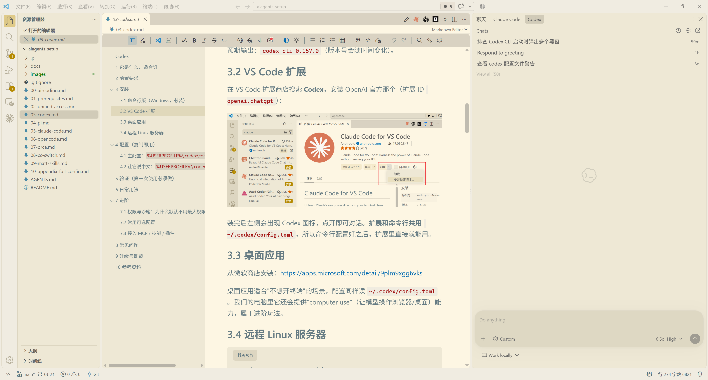
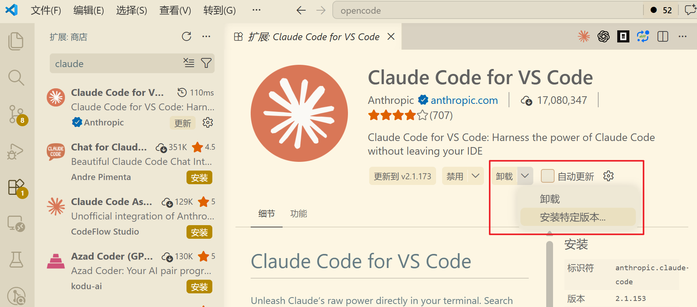
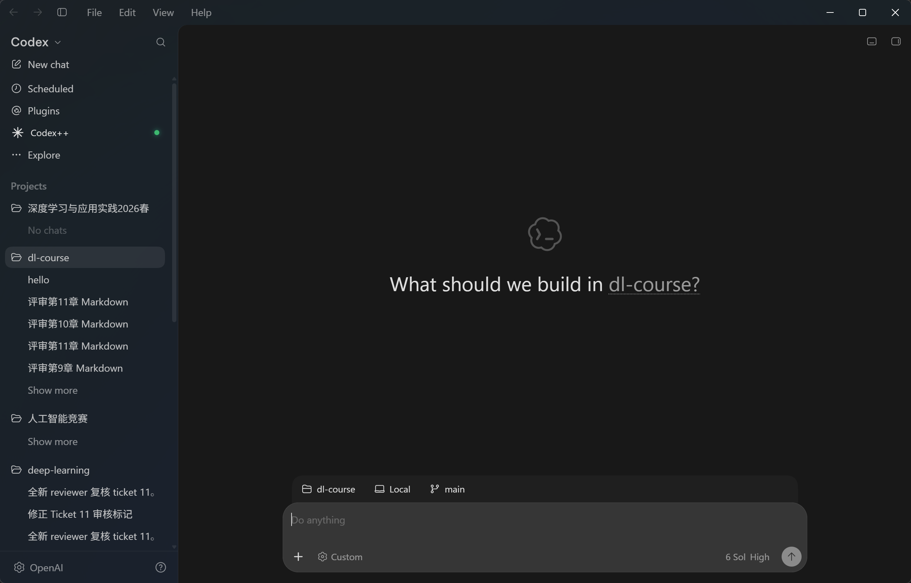
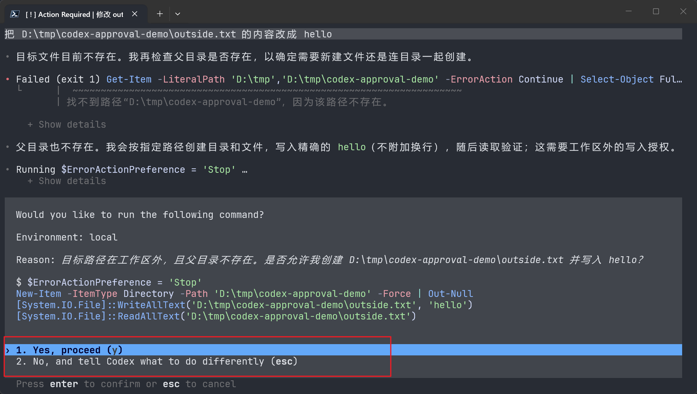

# Codex

**这是我们当前的主力工具。** 由 OpenAI 出品，命令行、VS Code 扩展、ChatGPT 桌面应用（Codex 的桌面形态现已并入 ChatGPT）三种形态齐全，接 GPT 系列模型时工具调用最稳，是"日常干活首选"。**它的命令行客户端还是开源的**（可审计、可自改，见第 10 节）。



---

# 1 它是什么、适合谁

- **定位**：OpenAI 官方的命令行编程智能体，与 Claude Code 齐名，两种属于同一能力梯队（**并不存在"Codex 能力超过 Claude Code"这回事**）；三种使用形态（终端 / VS Code 扩展 / ChatGPT 桌面应用）共用同一套配置。
- **适合**：绝大多数日常任务——读代码、改 bug、写脚本、跑命令、查文档。
- **优势**：与 GPT 系列模型同源，工具调用（读文件、跑命令、改代码）成功率高；**命令行客户端开源**；配置文件简单，CLI 不登录 OpenAI 账号也能使用我们的中转。
- **不适合**：需要超长上下文一次性吞下整个大仓库时，可换 pi 或 Claude Code 的长上下文模型；Claude Code 的选型与兼容性注意事项见 [Claude Code](06-claude-code.md) 第 8 节。

---

# 2 前置要求

| 项目 | 要求 | 检查方法 |
| --- | --- | --- |
| Node.js | ≥ 22（我们要用 npm 安装） | `node -v` |
| npm | 随 Node 自带（建议配置国内镜像） | `npm -v` |
| 环境变量 | `NEWAPI_KEY` 已设置 | `$env:NEWAPI_KEY.Length` → 输出 `51` |
| VS Code（可选） | 最新版 | `code --version` |

> `NEWAPI_KEY` 怎么设置见 **[统一接入](02-unified-access.md)** 第 2 节。没设置好后面一定报 401。

---

# 3 安装

## 3.1 命令行版（Windows，必装）

```PowerShell
npm install -g @openai/codex
codex --version
```

预期输出：`codex-cli 0.157.0`（版本号会随时间变化）。

## 3.2 VS Code 扩展

在 VS Code 扩展商店搜索 **Codex**，安装 OpenAI 官方那个（扩展 ID `openai.chatgpt`）：



装完后左侧会出现 Codex 图标，点开即可对话。**扩展和命令行共用 `~/.codex/config.toml`**，所以命令行配置好之后，扩展里直接就能用。

## 3.3 桌面应用（现已改名 ChatGPT）

从微软商店安装 **ChatGPT** 桌面应用：<https://apps.microsoft.com/detail/9plm9xgg6vks>



**注意**：Codex 原来的桌面版现在位于 **ChatGPT 桌面应用**中，不要去找一个叫"Codex 桌面版"的独立安装包。首次启动按应用提示认证：可登录 ChatGPT 账号，也可通过 API key 使用 Codex，但[部分功能可能不可用](https://learn.chatgpt.com/docs/quickstart)。本教程的 `NEWAPI_KEY` 用于中转模型请求，不能代替桌面应用的首次认证。进入应用后选择 **Codex**，它会读取同一份 `~/.codex/config.toml`；我们的电脑里它还提供"computer use"（让模型操作浏览器/桌面）能力。

## 3.4 远程 Linux 服务器

```Bash
npm install -g @openai/codex
mkdir -p ~/.codex

cat > ~/.codex/config.toml << 'EOF'
model = "gpt-6-sol"
model_provider = "newapi"
model_reasoning_effort = "medium"
approval_policy = "on-request"
sandbox_mode = "workspace-write"

[model_providers.newapi]
name = "NewAPI"
base_url = "https://newapi.ttxs.site/v1"
wire_api = "responses"
env_key = "NEWAPI_KEY"
requires_openai_auth = false

[sandbox_workspace_write]
network_access = true
EOF
```

再把 `export NEWAPI_KEY="sk-你的Key"` 写进 `~/.bashrc` 并 `source ~/.bashrc`，然后 `codex` 即可。

---

# 4 配置（复制即用）

## 4.1 主配置：`%USERPROFILE%\.codex\config.toml`

在 PowerShell 里直接执行下面这段，**会把配置写进正确位置**（已存在的会被覆盖，先看看有没有要保留的内容）：

```PowerShell
New-Item -ItemType Directory -Force "$env:USERPROFILE\.codex" | Out-Null
@'
# ===== 模型 =====
model = "gpt-6-sol"
model_provider = "newapi"
model_reasoning_effort = "medium"
personality = "pragmatic"

# ===== 权限 =====
approval_policy = "on-request"
sandbox_mode = "workspace-write"
web_search = "live"

# ===== 走我们的中转（密钥从 NEWAPI_KEY 环境变量读，配置文件里没有 Key）=====
[model_providers.newapi]
name = "NewAPI"
base_url = "https://newapi.ttxs.site/v1"
wire_api = "responses"
env_key = "NEWAPI_KEY"
requires_openai_auth = false

# 沙箱内允许联网（模型可以用 web_search、可以装依赖）
[sandbox_workspace_write]
network_access = true
'@ | Set-Content -Encoding utf8 "$env:USERPROFILE\.codex\config.toml"
```

**关键项说明**：

| 配置项 | 作用 | 可改成 |
| --- | --- | --- |
| `model` | 用哪个模型 | `gpt-6-luna`、`gpt-5.6-sol`；清单见 [统一接入](02-unified-access.md) 第 4 节 |
| `model_provider = "newapi"` | 用下面定义的 `[model_providers.newapi]` | 不要删 |
| `model_reasoning_effort` | 思考强度 | `low`（快）/ `medium`（默认）/ `high`、`xhigh`、`max`（慢而强） |
| `approval_policy = "on-request"` | 模型需要额外权限时问你 | `never`=从不问（**非交互式跑用这个**） |
| `sandbox_mode = "workspace-write"` | 只能改当前工作目录 | 见第 7 节"进阶：权限" |
| `env_key = "NEWAPI_KEY"` | **密钥来源** | 只写变量名，不要加 `$` |
| `requires_openai_auth = false` | 不要求登录 OpenAI 账号 | 不要删，否则会一直要求你登录 |

> 用 `env_key = "NEWAPI_KEY"` 这种写法时，**不需要** `codex login`，也不要把 Key 硬写进配置文件。

> ⚠️ **千万别写 `approval_policy = "untrusted"`**：官方从 **0.149.0** 起移除了这个值，而且是硬失败——配置里留着它 Codex **直接拒绝启动**：
> `Error loading configuration: approval_policy = "untrusted" is no longer supported; remove this setting`
> `on-failure` 也一并废弃了。**记住这两句：交互式用 `on-request`，非交互式（脚本、CI）用 `never`。**

## 4.2 让它说中文：`%USERPROFILE%\.codex\AGENTS.md`

```PowerShell
@'
- 始终用中文回答
- 修改代码前先说明要改哪些文件
- 复杂任务先给出计划，得到确认后再动手
- 当前系统是 Windows 11，命令行优先用 PowerShell
'@ | Set-Content -Encoding utf8 "$env:USERPROFILE\.codex\AGENTS.md"
```

`AGENTS.md` 是"随身的提示词"，Codex 每次干活都会读。**项目根目录**下也可以放一个 `AGENTS.md`，只对那个项目生效（推荐写项目的技术栈、运行命令、代码规范）。

---

# 5 验证（第一次使用必须做）

```PowerShell
cd D:\codes\some-project    # 换成任意一个你的项目目录
codex
```

进去以后输入一句话：

```
用一句话介绍这个仓库是做什么的
```

预期表现：它会真的去列目录、读文件，然后给出中文总结；界面底部能看到 `gpt-6-sol`、当前目录、剩余上下文。

再验证一次密钥链路（非交互模式，适合排错）：

```PowerShell
codex exec "只回复两个字：可用"
```

预期输出末尾出现 `可用`。如果报 `401 Invalid token`，回到 [统一接入](02-unified-access.md) 检查 `NEWAPI_KEY`。

---

# 6 日常用法

| 你想做的事 | 怎么做 |
| --- | --- |
| 进入交互界面 | 在项目目录里运行 `codex` |
| 继续上次对话 | `codex resume` |
| 一次性跑完不问 | `codex exec "把 xxx 改成 yyy"` |
| 让它在只读模式分析（不改文件） | `codex exec --sandbox read-only "分析这个 bug"` |
| 切换模型 | 界面里 `/model` |
| 换思考强度 | 界面里 `/reasoning`（或改配置里的 `model_reasoning_effort`） |
| 看当前会话用量 | 界面里 `/status` |
| 退出 | `/quit` 或 `Ctrl+C` |

**有效提问的三个习惯**（对四个工具都适用）：

1. **给判断标准**："改成用 pandas 读取，要求能处理缺失值"；
2. **要它先给计划**："先列出你要改的文件，我同意后再改"；
3. **一次一件事**，别把十个需求塞进一句话。

---

# 7 进阶

## 7.1 权限与沙箱：为什么默认不用最大权限

教程默认 `sandbox_mode = "workspace-write"` + `approval_policy = "on-request"`：模型**只能改当前目录的文件**，越界时会问你。

我们自己的机器上用的是更激进的配置：

```toml
sandbox_mode = "danger-full-access"
[windows]
sandbox = "elevated"
```

也就是**不限制目录、基本不问**。写得快，但代价是：模型可以改任何文件、跑任何命令，一次误操作可能删掉不该删的东西。



**建议**：先用默认值跑一两周，熟悉它的行为模式；确实被权限拦住影响效率时，再按上面放开，并且**只在重要的仓库上开**（重要仓库记得用 git，别裸奔）。

## 7.2 常用可选配置

```toml
# 状态栏显示什么（可选）
[tui]
status_line = ["model-with-reasoning", "current-dir", "git-branch", "context-used", "approval-mode"]

# 多套配置档：$CODEX_HOME/<名字>.config.toml，用 codex --profile <名字> 切换
# 例：把"写文档"和"改代码"分成两套模型/权限
```

## 7.3 接入 MCP / 技能 / 插件

Codex 支持 MCP 服务器、`skills`、`plugins`。技能用 `/skills` 挑选或 `$技能名` 显式调用（**不支持 `/技能名` 这种斜杠写法**）；现成的第三方技能包与装法见 [Matt Skills](09-matt-skills.md)。

```toml
[mcp_servers.context7]
command = "npx"
args = ["-y", "@upstash/context7-mcp"]
```

配置项较多，建议在**确认过基础用法**之后再折腾。我们自己的完整配置（含桌面段、插件市场、MCP）见 [附-完整配置](10-appendix-full-config.md)。

---

# 8 常见问题

| 现象 | 原因 / 解决 |
| --- | --- |
| `401 Invalid token` | `NEWAPI_KEY` 没生效。新开终端，`$env:NEWAPI_KEY.Length` 应为 51 |
| 一直提示登录 OpenAI | `requires_openai_auth = false` 漏了，或 `model_provider` 写错 |
| `model_not_found` / `No available channel for model` | 模型名不在清单里：先在 [pricing 页](https://newapi.ttxs.site/pricing) 确认它在不在，再对照 [统一接入](02-unified-access.md) 第 4 节 |
| 想让它在别的盘干活 | 先 `cd` 到那个目录再运行 `codex`；`workspace-write` 只允许改当前目录 |
| VS Code 扩展里报错 | 扩展与命令行共用配置；先在命令行确认 `codex exec "只回复两个字：可用"` 能正常回答 |
| 中文乱码（Windows） | 用 **Windows Terminal + PowerShell 7**，不要用老的 cmd 窗口 |
| 回答太慢 | `model_reasoning_effort` 降到 `low`，或换 `gpt-6-luna` |
| 上下文不够用 | 换上下文更大的模型，或用 `/compact` 压缩会话 |

---

# 9 升级与卸载

```PowerShell
npm install -g @openai/codex     # 升级到最新版
npm uninstall -g @openai/codex   # 卸载（配置目录 ~/.codex 不会被删）
```

VS Code 扩展和 ChatGPT 桌面应用各自在应用内升级。配置、会话、`AGENTS.md` 都保存在 `%USERPROFILE%\.codex`，卸载重装不会丢。

---

# 10 参考资料

1. Codex 官方文档：<https://developers.openai.com/codex>
2. 源码（命令行客户端开源）：<https://github.com/openai/codex>
3. VS Code 扩展（扩展 ID `openai.chatgpt`）：<https://marketplace.visualstudio.com/items?itemName=openai.chatgpt>
4. 桌面应用（微软商店，装 ChatGPT，Codex 的桌面形态已并入其中）：<https://apps.microsoft.com/detail/9plm9xgg6vks>
5. 配置项完整参考：<https://developers.openai.com/codex/config>
6. 统一接入与模型清单：见本仓库 [统一接入](02-unified-access.md)
7. **实时查看可用模型与价格**：<https://newapi.ttxs.site/pricing>
