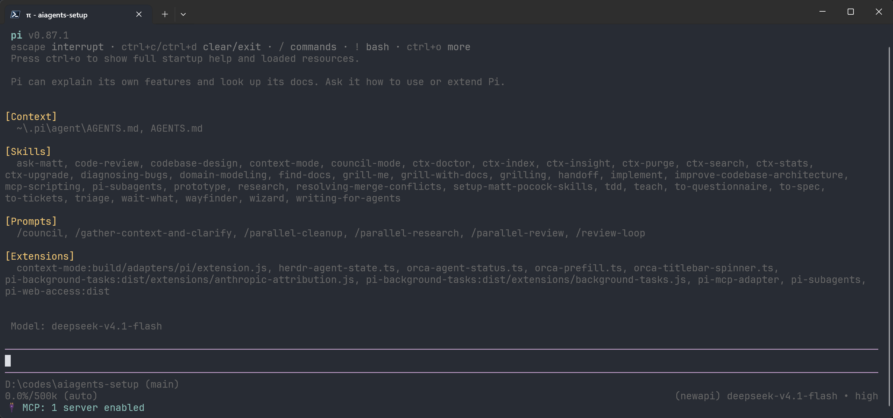

# pi

**次主力工具。** 开源、极轻量的终端 AI 编程智能体（Pi Coding Agent），启动快、可扩展、几乎能接任何模型，适合喜欢"干净终端 + 自己折腾"的人。



---

# 1 它是什么、适合谁

- **定位**：终端里的 AI 编程智能体框架，不是"某家公司专属的客户端"。核心特点：小、快、开源、可通过扩展（extensions）/技能（skills）/插件包（packages）自由扩展。
- **适合**：想用国产模型 + 长上下文干活、想自己加工具/加插件、想要一个"能读懂你整套配置"的助手。
- **优势**：配置全部是明文 JSON，改起来直观；支持自定义供应商（我们的 NewAPI 就是这么接的）；自带会话续接、模型切换、思考强度切换。
- **注意**：它在 **Windows 上依赖 Git Bash**（见 3.0），这是最容易踩的坑。

---

# 2 前置要求

| 项目 | 要求 | 检查方法 |
| --- | --- | --- |
| Node.js | **≥ 22.19** | `node -v` |
| **Git for Windows** | 必装（pi 用它执行命令） | `bash --version` |
| 环境变量 | `NEWAPI_KEY` 已设置 | `$env:NEWAPI_KEY.Length` → `51` |
| Windows Terminal + PowerShell 7 | 建议（中文与按键体验好） | `pwsh -v` |

> 密钥设置见 **[统一接入](02-unified-access.md)** 第 2 节。
> Git for Windows 下载：<https://git-scm.com/download/win>（安装时一路默认即可）。

---

# 3 安装

## 3.1 官方脚本安装（Windows，最省事）

```PowerShell
powershell -c "irm https://pi.dev/install.ps1 | iex"
```

## 3.2 npm 安装（推荐，便于统一升级/卸载）

```PowerShell
npm install -g --ignore-scripts @earendil-works/pi-coding-agent
pi --version
```

预期输出：`0.87.1`（版本号会变）。

> `--ignore-scripts` 表示安装期间不执行依赖的生命周期脚本。pi 的正常 npm 安装不需要这些脚本，加上它更安全。

## 3.3 远程 Linux 服务器

```Bash
curl -fsSL https://pi.dev/install.sh | sh
# 或者：npm install -g --ignore-scripts @earendil-works/pi-coding-agent
pi --version
```

Linux 服务器自带 bash，不需要额外装 Git for Windows。

---

# 4 配置（复制即用）

pi 的配置目录是 `%USERPROFILE%\.pi\agent`；在 PowerShell 里执行下面两段即可写好两个文件。

## 4.1 接入 NewAPI：`%USERPROFILE%\.pi\agent\models.json`

```PowerShell
New-Item -ItemType Directory -Force "$env:USERPROFILE\.pi\agent" | Out-Null
@'
{
  "providers": {
    "newapi": {
      "baseUrl": "https://newapi.ttxs.site/v1",
      "api": "openai-responses",
      "apiKey": "$NEWAPI_KEY",
      "models": [
        { "id": "glm-5.3-flash", "name": "GLM-5.3 Flash", "api": "openai-completions", "reasoning": true, "input": ["text"], "contextWindow": 500000, "maxTokens": 128000 },
        { "id": "deepseek-v4.1-flash", "name": "DeepSeek V4.1 Flash", "reasoning": true, "input": ["text"], "contextWindow": 500000, "maxTokens": 128000 },
        { "id": "gpt-6-sol", "name": "GPT-6 Sol", "reasoning": true, "input": ["text", "image"], "contextWindow": 258000, "maxTokens": 128000 }
      ]
    }
  }
}
'@ | Set-Content -Encoding utf8 "$env:USERPROFILE\.pi\agent\models.json"
```

**这段配置的三个要点**：

| 要点 | 说明 |
| --- | --- |
| `"apiKey": "$NEWAPI_KEY"` | pi 支持 `$变量名` / `${变量名}` 插值，**密钥不落盘**。别写成 `{env:...}`（那是 OpenCode 的写法） |
| `"api": "openai-responses"` | 供应商级默认协议；个别模型可覆盖，例如上面 `glm-5.3-flash` 单独用 `openai-completions` |
| `models[]` 里每个 `id` | 必须是中转真实存在的模型名，清单见 [统一接入](02-unified-access.md) 第 4 节 |

## 4.2 默认模型与偏好：`%USERPROFILE%\.pi\agent\settings.json`

```PowerShell
@'
{
  "theme": "dark",
  "defaultProvider": "newapi",
  "defaultModel": "glm-5.3-flash",
  "defaultThinkingLevel": "high",
  "shellPath": "C:/Program Files/PowerShell/7/pwsh.exe"
}
'@ | Set-Content -Encoding utf8 "$env:USERPROFILE\.pi\agent\settings.json"
```

| 配置项 | 作用 |
| --- | --- |
| `defaultProvider` / `defaultModel` | 启动时默认用哪个模型 |
| `defaultThinkingLevel` | 思考强度：`off`/`low`/`medium`/`high`/`max` |
| `shellPath` | 指定 bash 可执行文件；**只有 Git Bash 装在非常规路径时才需要**。若你的路径不同，删掉这行让 pi 自动探测 |
| `theme` | `dark` / `light` |

> 如果执行后 `pi` 报"找不到 bash"，先确认装了 Git for Windows；仍报错就用 `shellPath` 显式指定，例如 `"C:/Program Files/Git/bin/bash.exe"`（注意 JSON 里的 Windows 路径要把反斜杠写成 `/` 或 `\\`）。

## 4.3 让它说中文：`%USERPROFILE%\.pi\agent\AGENTS.md`

```PowerShell
@'
- 始终用中文回答
- 复杂任务先给出计划，得到确认后再动手
- 当前系统是 Windows 11：命令行用 PowerShell 语法
- 优先给出可直接复制执行的命令
'@ | Set-Content -Encoding utf8 "$env:USERPROFILE\.pi\agent\AGENTS.md"
```

pi 会按层级读：`~/.pi/agent/AGENTS.md`（全局）→ 项目目录的 `AGENTS.md`（只对该项目生效）。

---

# 5 验证（第一次使用必须做）

```PowerShell
pi --list-models
```

预期能在列表里看到 `newapi` 下的 `glm-5.3-flash`、`deepseek-v4.1-flash`、`gpt-6-sol`。**看不到 newapi 的模型 = `models.json` 里 `$NEWAPI_KEY` 没解析成功**（多半是环境变量没生效）。

再跑一次非交互调用：

```PowerShell
pi -p "只回复两个字：可用" --provider newapi --model glm-5.3-flash
```

预期输出：`可用`。

最后进交互界面做一次真实任务：

```PowerShell
cd D:\codes\some-project
pi
```

输入：`用一句话介绍这个仓库是做什么的`。它会读文件后给出中文总结。

> 首次在某个目录运行 pi 可能会问是否"信任该项目"——因为项目里的配置/扩展会执行代码。确认是自己的项目再信任。

---

# 6 日常用法

| 你想做的事 | 怎么做 |
| --- | --- |
| 进入交互界面 | 在项目目录运行 `pi` |
| 让 pi 读某个文件 | 输入 `@` 然后搜索文件名（比手打全路径快） |
| 自己跑一条命令 | 输入 `!` 开头，例如 `!git status` |
| 继续上次对话 | `pi --continue`（或启动后 `/resume` 选历史会话） |
| 换模型 | `/model`（`Ctrl+P` 循环切换；`Ctrl+S` 存为默认） |
| 换思考强度 | `/thinking` |
| 压缩长会话 | `/compact` |
| 导出会话 | `/export` |
| 看会话信息/用量 | `/session` |
| 退出 | `/quit` |

**验证命令链路是否正常**（Windows 上排查 Git Bash 问题最有用）：进去后输入

```
!printf 'Bash is working\n'
```

预期输出 `Bash is working`。如果报"找不到 bash"，见第 8 节。

---

# 7 进阶

## 7.1 让模型用 PowerShell 而不是 bash（可选）

Windows 上 pi 默认通过 Git Bash 执行命令。如果你的任务更依赖 PowerShell 模块，可以在 `settings.json` 里换成 PowerShell 工具：

```json
{
  "defaultTools": ["read", "powershell", "edit", "write"]
}
```

注意：换了之后 `!` / `!!` 手动命令**仍然走 bash**，只有模型自己调用的命令行工具变成 PowerShell。仅 Windows 原生运行时可用（WSL 里没有这个工具）。

## 7.2 插件包（packages）

pi 的扩展是通过"包"分发的，一条命令安装：

```PowerShell
pi install npm:pi-web-access        # 联网搜索/抓网页
pi install npm:pi-subagents         # 子智能体（并行干活）
pi install npm:pi-mcp-adapter       # 接 MCP
pi install npm:pi-background-tasks  # 长任务后台跑
pi install npm:context-mode         # 省上下文
```

我们自己的机器装了上面这几个，**建议先把基础用法跑顺，再按需要一个个加**。完整清单见 [附-完整配置](10-appendix-full-config.md)。

## 7.3 技能 / 扩展 / 子智能体

- **技能（skills）**：把一个专门任务的说明+附带文件打包，通过 `/skill:名字` 调用；适合"每次都按同一套流程做"的活。现成的第三方技能包见 [Matt Skills](09-matt-skills.md)。
- **扩展（extensions）**：TypeScript 写的插件，能加工具、加命令、改界面，是"自己能写代码改 pi"的那一层。
- **子智能体（subagents）**：把一个任务拆给多个模型并行处理（`pi-subagents` 包提供）。
- **MCP**：接入外部工具服务（如 context7 查文档）。

## 7.4 换配置目录（多套配置）

```PowerShell
$env:PI_CODING_AGENT_DIR = "D:\pi-configs\work"
```

用环境变量指向另一个配置目录，就能在"工作/实验"两套配置间切换（测试新配置时很有用，不会污染主配置）。

---

# 8 常见问题

| 现象 | 原因 / 解决 |
| --- | --- |
| 报"找不到 bash" / bash 相关报错 | **没装 Git for Windows**。装完后重启终端；仍不行就用 `shellPath` 指定 `bash.exe` 路径 |
| `--list-models` 里没有 newapi 的模型 | `$NEWAPI_KEY` 没生效（环境变量没设或没新开终端）；确认 `$env:NEWAPI_KEY.Length` 是 51 |
| 报 `401` / `Invalid token` | 同上，或 Key 填错 |
| 报 `model_not_found` | `models.json` 里的 `id` 不在中转清单里：先在 [pricing 页](https://newapi.ttxs.site/pricing) 确认它在不在，再对照 [统一接入](02-unified-access.md) 第 4 节 |
| 模型能选但回答很慢 | 降 `defaultThinkingLevel`（`high`→`medium`/`low`），或换 `gpt-6-luna` 这类更快的模型 |
| 中文输出乱码 | 用 Windows Terminal + PowerShell 7；`chcp 65001` 也可临时救急 |
| 项目里 `AGENTS.md` 不生效 | 确认文件名是全大写 `AGENTS.md`，且在当前工作目录或它的上层目录 |
| 想彻底重来 | 删掉 `%USERPROFILE%\.pi\agent\models.json` 重新执行第 4 节 |

---

# 9 升级与卸载

```PowerShell
pi update                                   # 升级 pi 本体
pi update --models                          # 刷新模型目录缓存
npm install -g --ignore-scripts @earendil-works/pi-coding-agent   # 升级到最新版
npm uninstall -g @earendil-works/pi-coding-agent                  # 卸载
```

卸载**不会**删除配置、会话与已装插件（都在 `%USERPROFILE%\.pi\agent`）。彻底清理就手动删掉该目录。

---

# 10 参考资料

1. 官网与文档：<https://pi.dev/>
2. 源码仓库：<https://github.com/earendil-works/pi>
3. 中文文档镜像：<https://pi-agent.org/docs>
4. 快速开始（英文原版）：<https://github.com/earendil-works/pi/blob/main/packages/coding-agent/docs/quickstart.md>
5. 统一接入与模型清单：见本仓库 [统一接入](02-unified-access.md)
6. **实时查看可用模型与价格**：<https://newapi.ttxs.site/pricing>