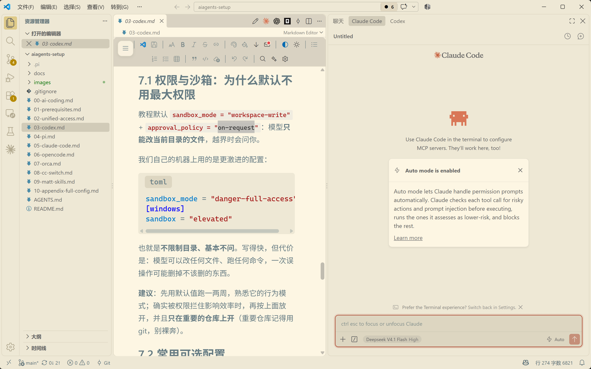
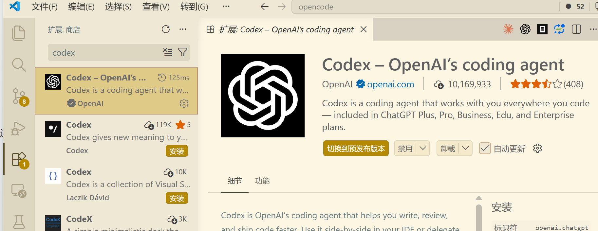
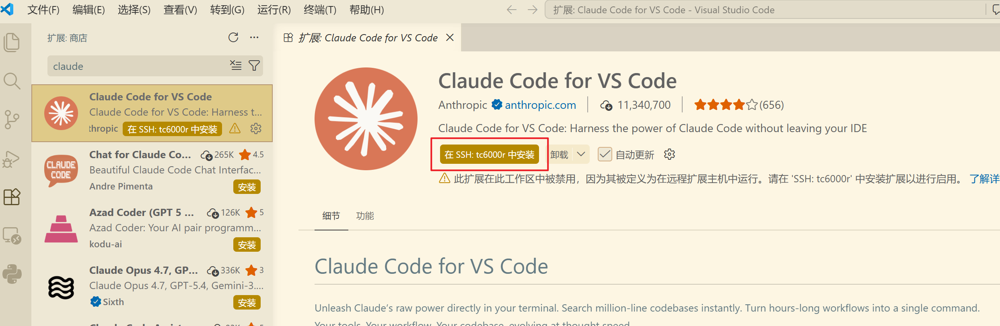

# Claude Code

**辅助工具。** Anthropic 官方的命令行编程智能体，推理细致、生态成熟，是命令行 AI 编程的事实标准；但成本高、对第三方模型的兼容性会随版本变化（尤其图片相关功能，见第 8 节）。



---

# 1 它是什么、适合谁

- **定位**：Anthropic 官方客户端，最先带火"命令行 AI 编程"这条路的工具，目前版本迭代极快（我们写这份文档时是 2.1.x）。
- **适合**：需要细致推理与多步规划的任务；想用 VS Code 扩展直接在编辑器里对话；需要"官方客户端体验"的人（它自带大量工程化细节）。
- **注意**：
  - 它是**闭源商业产品**，优化深度天然偏向 Anthropic 自家模型；接到第三方模型（比如我们的中转）上时，偶尔会出现兼容性小毛病，需要跟着版本更新；
  - 图片相关的功能在第三方模型下明显不稳（第 8 节）。

---

# 2 前置要求

| 项目 | 要求 | 检查方法 |
| --- | --- | --- |
| Node.js | ≥ 22 | `node -v` |
| 环境变量 | `ANTHROPIC_AUTH_TOKEN` 已设置（**注意不是** `NEWAPI_KEY`） | `$env:ANTHROPIC_AUTH_TOKEN.Length` → `51` |
| VS Code（可选） | 最新版 | `code --version` |

> 两个环境变量怎么设置见 **[统一接入](02-unified-access.md)** 第 2 节。Claude Code 只认 `ANTHROPIC_AUTH_TOKEN` 这个名字。

---

# 3 安装

## 3.1 命令行版（Windows）

```PowerShell
npm install -g @anthropic-ai/claude-code
claude --version
```

预期输出：`2.1.282 (Claude Code)`（版本号会变）。

官方还提供了免 Node 的原生安装方式（可选）：

```PowerShell
irm https://claude.ai/install.ps1 | iex
```

> 建议**跟随官方稳定版**，不要长期锁在某个旧版本：Claude Code 的第三方模型兼容性修复都在新版本里。

## 3.2 VS Code 扩展

在扩展商店搜索 **Claude Code**，安装 Anthropic 官方那个（扩展 ID `anthropic.claude-code`）：



装完后 VS Code 侧边栏会出现 Claude 图标。扩展与命令行**共用** `%USERPROFILE%\.claude\settings.json`，所以先按第 4 节配好命令行，扩展里直接可用。

## 3.3 远程 Linux 服务器

```Bash
npm install -g @anthropic-ai/claude-code
mkdir -p ~/.claude

cat > ~/.claude/settings.json << 'EOF'
{
  "language": "简体中文",
  "model": "sonnet",
  "alwaysThinkingEnabled": true,
  "effortLevel": "high",
  "autoUpdatesChannel": "stable",
  "env": {
    "ANTHROPIC_BASE_URL": "https://newapi.ttxs.site",
    "ANTHROPIC_MODEL": "deepseek-v4.1-flash[1M]",
    "ANTHROPIC_DEFAULT_FABLE_MODEL": "glm-5.3-flash",
    "ANTHROPIC_DEFAULT_FABLE_MODEL_NAME": "glm-5.3-flash",
    "ANTHROPIC_DEFAULT_OPUS_MODEL": "claude-opus-5-5[1M]",
    "ANTHROPIC_DEFAULT_OPUS_MODEL_NAME": "claude-opus-5-5",
    "ANTHROPIC_DEFAULT_SONNET_MODEL": "deepseek-v4.1-flash[1M]",
    "ANTHROPIC_DEFAULT_SONNET_MODEL_NAME": "Deepseek V4.1 Flash",
    "ANTHROPIC_DEFAULT_HAIKU_MODEL": "gpt-6-luna",
    "ANTHROPIC_DEFAULT_HAIKU_MODEL_NAME": "gpt-6-luna",
    "CLAUDE_CODE_SUBAGENT_MODEL": "deepseek-v4.1-flash[1M]",
    "CLAUDE_CODE_USE_POWERSHELL_TOOL": "0"
  }
}
EOF

cat > ~/.claude/CLAUDE.md << 'EOF'
- 始终用中文回答
- 复杂任务先给出计划，得到确认后再动手
- 优先给出可直接复制执行的命令
EOF
```

再把 `export ANTHROPIC_AUTH_TOKEN="sk-你的Key"` 追加到 `~/.bashrc` 并 `source ~/.bashrc`。

> 服务器上把 `CLAUDE_CODE_USE_POWERSHELL_TOOL` 设成 `0`（或者干脆删掉这一行）——那是 Windows 专用开关。

如果你是在**本地 VS Code 里用 Remote-SSH 连服务器**，还得把扩展装到**远端**才生效：扩展商店里会出现“在 SSH: <主机名> 中安装”，点它就对了。



---

# 4 配置（复制即用）

## 4.1 主配置：`%USERPROFILE%\.claude\settings.json`

```PowerShell
New-Item -ItemType Directory -Force "$env:USERPROFILE\.claude" | Out-Null
@'
{
  "language": "简体中文",
  "model": "sonnet",
  "alwaysThinkingEnabled": true,
  "effortLevel": "high",
  "autoUpdatesChannel": "stable",
  "defaultShell": "powershell",
  "env": {
    "ANTHROPIC_BASE_URL": "https://newapi.ttxs.site",
    "ANTHROPIC_MODEL": "deepseek-v4.1-flash[1M]",
    "ANTHROPIC_DEFAULT_FABLE_MODEL": "glm-5.3-flash",
    "ANTHROPIC_DEFAULT_FABLE_MODEL_NAME": "glm-5.3-flash",
    "ANTHROPIC_DEFAULT_OPUS_MODEL": "claude-opus-5-5[1M]",
    "ANTHROPIC_DEFAULT_OPUS_MODEL_NAME": "claude-opus-5-5",
    "ANTHROPIC_DEFAULT_SONNET_MODEL": "deepseek-v4.1-flash[1M]",
    "ANTHROPIC_DEFAULT_SONNET_MODEL_NAME": "Deepseek V4.1 Flash",
    "ANTHROPIC_DEFAULT_HAIKU_MODEL": "gpt-6-luna",
    "ANTHROPIC_DEFAULT_HAIKU_MODEL_NAME": "gpt-6-luna",
    "CLAUDE_CODE_SUBAGENT_MODEL": "deepseek-v4.1-flash[1M]",
    "CLAUDE_CODE_USE_POWERSHELL_TOOL": "1",
    "CLAUDE_CODE_DISABLE_NONESSENTIAL_TRAFFIC": "1"
  }
}
'@ | Set-Content -Encoding utf8 "$env:USERPROFILE\.claude\settings.json"
```

**注意**：这份配置里**没有密钥**——它来自系统环境变量 `ANTHROPIC_AUTH_TOKEN`，所以配置文件可以随便复制给别人。

| 配置项 | 作用 |
| --- | --- |
| `ANTHROPIC_BASE_URL` | 走我们的中转。**不要带 `/v1`**（Claude Code 用 Anthropic 协议） |
| `ANTHROPIC_MODEL` | 默认模型 |
| `ANTHROPIC_DEFAULT_OPUS/SONNET/HAIKU_MODEL` | 把 Claude 的三个模型档位（opus/sonnet/haiku）映射到我们的模型；`_NAME` 那一行是界面上显示的中文/友好名 |
| `ANTHROPIC_DEFAULT_FABLE_MODEL` | 对应新版 Claude Code 里的第 4 个档位，旧版本不认这一项也没关系（会被忽略） |
| `..._MODEL` 末尾的 `[1M]` | **Claude Code 客户端自己的写法**：表示"用 1M 上下文"。它会把这个后缀处理掉再发请求，所以中转那边看到的仍是普通模型名。**这个后缀只对 Claude Code 有意义，不要抄到别的工具里** |
| `CLAUDE_CODE_SUBAGENT_MODEL` | 子智能体用哪个模型 |
| `CLAUDE_CODE_USE_POWERSHELL_TOOL` | Windows 上让模型执行 PowerShell（`1` 开启） |
| `CLAUDE_CODE_DISABLE_NONESSENTIAL_TRAFFIC` | 关掉不必要的遥测请求，更快更省 |
| `language` | 界面与回复语言 |
| `effortLevel` | 出力档位：`low`/`medium`/`high` |
| `autoUpdatesChannel` | 跟稳定版通道 |

## 4.2 可选：`%USERPROFILE%\.claude\config.json`

如果启动时被要求登录 Anthropic 账号，加这个文件跳过：

```PowerShell
@'
{
  "primaryApiKey": "any"
}
'@ | Set-Content -Encoding utf8 "$env:USERPROFILE\.claude\config.json"
```

## 4.3 让它说中文：`%USERPROFILE%\.claude\CLAUDE.md`

```PowerShell
@'
- 始终用中文回答
- 复杂任务先给出计划，得到确认后再动手
- 优先给出可直接复制执行的命令
- 当前系统是 Windows 11，命令行用 PowerShell 语法
'@ | Set-Content -Encoding utf8 "$env:USERPROFILE\.claude\CLAUDE.md"
```

`CLAUDE.md` 是全局提示词，项目根目录里也可以放一份只在那个项目生效。

---

# 5 验证

```PowerShell
claude -p "只回复两个字：可用"
```

预期输出：`可用`。如果报 401，回到 [统一接入](02-unified-access.md) 检查 `ANTHROPIC_AUTH_TOKEN`。

然后进交互界面确认模型列表：

```PowerShell
cd D:\codes\some-project
claude
```

输入 `/model`，应该能看到 sonnet / opus / fable / haiku 档位，并且**模型名显示为 `Deepseek V4.1 Flash`、`glm-5.3-flash`、`claude-opus-5-5`、`gpt-6-luna` 这类我们映射的名字**——说明配置生效。

![Claude Code 里 `/model` 的选择列表：顶部显示当前为 deepseek-v4.1-flash[1M] with high effort；列表里 Default 是 claude-opus-5-5[1m]，另有 claude-opus-5-5、glm-5.3-flash、Deepseek V4.1 Flash、gpt-6-luna 四档映射模型，当前选中 deepseek-v4.1-flash[1M]](images/claude-code-model-list.png)

---

# 6 日常用法

| 你想做的事 | 怎么做 |
| --- | --- |
| 进入交互界面 | 在项目目录运行 `claude` |
| 一次性执行（脚本/排错用） | `claude -p "你的要求"` |
| 继续上一次对话 | `claude -c`（或 `claude -r` 选历史会话） |
| 临时换模型 | `/model`，或 `claude --model gpt-6-luna` |
| 压缩长会话 | `/compact` |
| 清空上下文 | `/clear` |
| 看权限设置 | `/permissions` |
| 中断它正在做的事 | `Esc` |
| 退出 | `/quit` 或 `Ctrl+C` |

---

# 7 进阶

我们自己的机器上给 Claude Code 加了不少工程化配置（禁用一批工具、用 hooks 强制 `pnpm`/`uv`、自定义状态栏、安装插件市场等），**完整内容见 [附-完整配置](10-appendix-full-config.md)**。这里只说两条最值得了解的：

## 7.1 权限模式

`settings.json` 里可以精细控制它允许做什么：

```json
{
  "permissions": {
    "allow": ["WebFetch", "WebSearch"],
    "deny": ["Bash"],
    "defaultMode": "auto"
  }
}
```

`deny: ["Bash"]` 意味着**模型不能自己执行任何命令**（只读代码、改代码、搜网页）。这对"只想让它当个编辑器"的人很合适，但会明显削弱能力——所以**教程默认不给这份配置**，按需再加。

## 7.2 hooks / 插件 / 状态栏

- **hooks**：在"模型要执行某个工具之前/之后"插入你自己的脚本（比如拦截危险命令）。我们用它强制"不许 `npm install`，改用 `pnpm`"。
- **插件（plugins）**：官方与社区插件市场，用来加 LSP、加工具、改状态栏。
- 这些都属于"配置复杂度明显上升"的玩法，建议**先把基础用法跑顺。**

---

# 8 为什么 Claude Code 现在处理图片有问题

这一节解释现象、给出数据与来源，**不需要你改任何配置就能验证**。

## 8.1 现象

接到第三方模型（我们的中转）之后，Claude Code 处理图片会出现两类表现：

1. **让它自己去"读本地图片文件"时**，要么直接报错，要么图片被处理成异常巨大的内容；
2. **粘贴图片的入口在若干版本里被改坏过**。

## 8.2 数据（不是感觉，是量出来的）

- **我们自己量过的例子**：把一张 8×8 的小 PNG 直接附在提示里（`claude -p "这张图是什么颜色 @图片路径"`），返回 **"红色"**，`is_error=false`。→ **直接附图是可以用的。**
- **外部独立对照数据**（2026 年，同一张图、10 款模型）：

  | 传入方式 | Claude 官方模型 | 第三方模型（9 款） |
  | --- | --- | --- |
  | 直接把图拖进对话窗口 | ✅ 约 2,000 tokens | ✅ 10/10 成功，约 2,000 tokens |
  | 让 Claude Code 用 **Read 工具**去读本地图片 | ✅ 正常 | ❌ 3 款直接失败、6 款勉强返回但**消耗 40 万~43 万 tokens（约 200~250 倍）**，小上下文模型直接 `400` / `context_length_exceeded` |

- **Anthropic 自己把入口改坏过**：claude-code 仓库里 `Paste image not working`（#58518）、`Image paste from clipboard no longer works`（#26901）、`粘贴/拖拽的图片不再暴露文件系统路径`（#57623）等 issue 长期存在。

## 8.3 原因

Claude Code 是 **Anthropic 自家的客户端**，它的工具行为和图片流水线是按 Anthropic 自家模型的能力调优的。换成第三方模型之后：

- Claude Code 根本不认识这个模型（启动时会打一行 `[claude-code:unrecognized_model]` 警告），于是图片相关的兼容路径没人负责；
- 一旦走"模型自己调 Read 工具读图片"这条路，图片会被以某种异常方式塞进上下文，token 直接暴涨两三百倍；
- 而 Anthropic 又反复改这块功能，于是"能不能看图"变成了玄学。

一句话：**不是我们的中转不行（中转的图片接口本身是正常的，`claude-opus-5`、`deepseek-v4.1-flash` 都能收图），是 Claude Code 这个客户端在第三方模型上把图片这条路做坏了。**

## 8.4 怎么办（推荐做法）

| 需求 | 建议 |
| --- | --- |
| 处理一张截图 / 图片 | ① 在 Claude Code 里**直接把图拖进对话窗口或粘贴**（不要让它用 Read 工具去读图片文件路径）；② 或者干脆**用 Codex 处理**（Codex 读图正常，属于主力工具） |
| 需要 OCR / 图表理解 | 优先 Codex |
| 一定要在 Claude Code 里用图片 | 用支持图片的模型档位（例如我们映射的 `gpt-6-luna`/`gpt-6-sol` 系列），并注意观察 token 消耗 |

---

# 9 常见问题

| 现象 | 原因 / 解决 |
| --- | --- |
| `401` / 要求登录 | `ANTHROPIC_AUTH_TOKEN` 没生效（新开终端确认长度 51）；仍要求登录就加 4.2 的 `config.json` |
| `/model` 里看不到我们的模型 | `settings.json` 的 `env` 块没写对，或文件位置不对（必须是 `%USERPROFILE%\.claude\settings.json`） |
| 报协议/400 错误 | `ANTHROPIC_BASE_URL` 填成了带 `/v1` 的 OpenAI 地址；Claude Code 必须填 `https://newapi.ttxs.site` |
| 启动时 `[claude-code:unrecognized_model]` | 正常警告（第三方模型它不认识），能正常回答就忽略 |
| VS Code 扩展里模型不对 | 扩展与命令行共用配置；先在命令行确认 `claude -p "只回复两个字：可用"` 能正常回答 |
| 读图报错 / token 暴涨 | 见第 8 节 |
| 更新后行为变了 | 第三方模型兼容性跟版本强相关；先升级到最新稳定版再看 |

---

# 10 升级与卸载

```PowerShell
npm install -g @anthropic-ai/claude-code@latest   # 升级
npm uninstall -g @anthropic-ai/claude-code        # 卸载（~/.claude 不会删）
```

配置、会话、`CLAUDE.md` 都在 `%USERPROFILE%\.claude`，重装不丢。

---

# 11 参考资料

1. 官方文档（中文）：<https://code.claude.com/docs/zh-CN/>
2. 设置文件与优先级：<https://code.claude.com/docs/zh-CN/settings>
3. 环境变量：<https://code.claude.com/docs/zh-CN/env-vars>
4. VS Code 扩展：<https://marketplace.visualstudio.com/items?itemName=anthropic.claude-code>
5. 统一接入与模型清单：见本仓库 [统一接入](02-unified-access.md)
6. **实时查看可用模型与价格**：<https://newapi.ttxs.site/pricing>