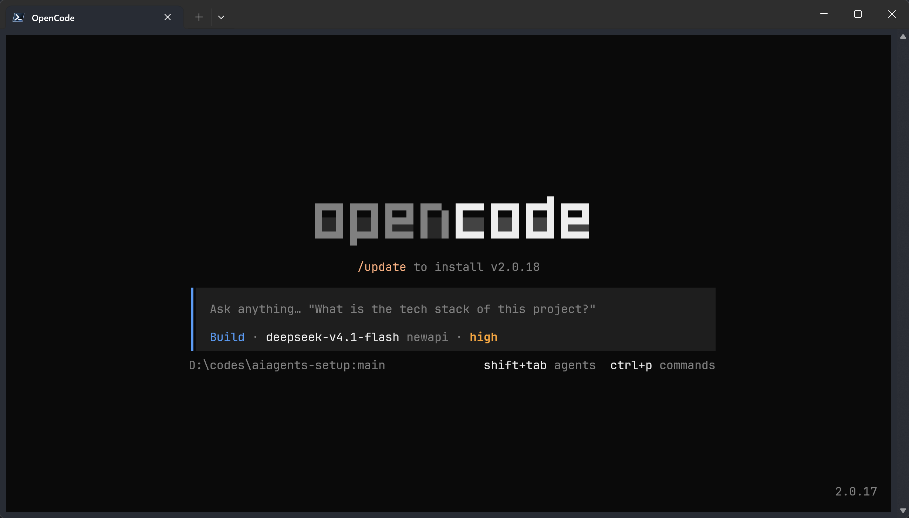
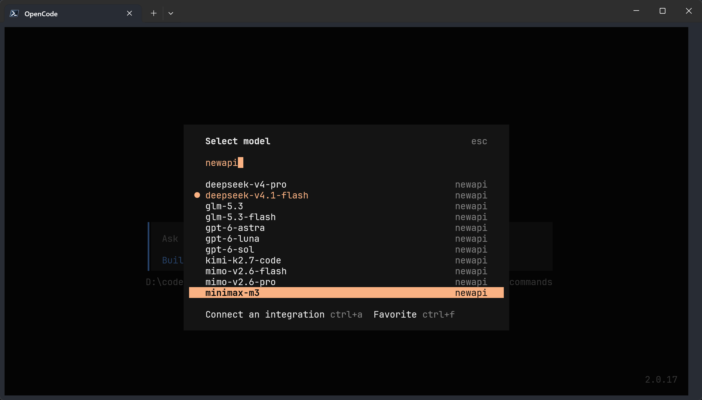

# OpenCode

**辅助工具。** 开源、通用的终端 AI 编程智能体：几乎什么模型都能接，终端 / IDE / 桌面端都有入口。它已经发展成为一个能真正干活的独立产品（v2），我们在当前工作流中将它作为辅助客户端；这个顺序不是普遍能力排名。



---

# 1 它是什么、适合谁

- **定位**：社区驱动的开源 AI 编程智能体。它本身**不绑定模型**，用"供应商"的方式接任意模型（我们接的是 NewAPI 中转）。
- **适合**：想用完全开源的工具、想一套配置到处跑（终端 / IDE / 桌面）、想接各种国产模型对比效果的人。
- **优势**：开源可审计；供应商配置灵活；界面现代化，默认信息密度高。
- **需要知道的两件事**：
  1. **结果取决于模型和客户端配合**：先固定模型、任务和参数，再比较工具调用与输出；不能根据是否生产自家模型判断能力；
  2. **它是 v2 了**，配置格式与网上大量 v1 教程**不兼容**（`provider` 变 `providers`、`npm` 变 `package`、`options` 变 `settings`）。本篇按 **v2** 写。

---

# 2 前置要求

| 项目 | 要求 | 检查方法 |
| --- | --- | --- |
| Node.js | ≥ 22.19.0（本教程 npm 路线统一基线） | `node -v` |
| 环境变量 | `NEWAPI_KEY` 已设置 | `-not [string]::IsNullOrWhiteSpace($env:NEWAPI_KEY)` → `True` |
| Git for Windows | Bash 命令执行路线需要 | 按 [前置工具](01-prerequisites.md#2-git-for-windows)检查 Git Bash 路径 |

> 密钥设置见 **[统一接入](02-unified-access.md)** 第 2 节。若模型执行命令时报找不到 bash，装 Git for Windows，或用环境变量 `OPENCODE_GIT_BASH_PATH` 指向 `bash.exe`。

---

# 3 安装

## 3.1 Windows（npm 安装 v2，推荐）

```PowerShell
npm install -g @opencode/cli
opencode --version
```

版本输出示例：`2.0.16`；应为 v2，记录基线见 [README 第 4 节](README.md#4-版本基线与核验状态)。

> ⚠️ **别装错包**：v2 的 npm 包是 **`@opencode/cli`**；网上老教程里的 `opencode-ai` 是 **v1** 旧线（版本还是 1.18.x），两者配置格式不同。教程使用 `@opencode/cli`；字段迁移依据见 [官方 v2 迁移文档](https://opencode.ai/v2/docs/migrate-v1)。

## 3.2 官方脚本（可选）

官方一键脚本会自动装最新版：

```Bash
curl -fsSL https://opencode.ai/install | bash
```

## 3.3 远程 Linux 服务器

```Bash
npm install -g @opencode/cli
mkdir -p ~/.config/opencode
# 配置文件写法见第 4 节，把 opencode.json 放到 ~/.config/opencode/
```

凭据设置与备份见 [统一接入第 2.3 节](02-unified-access.md#23-远程-linux-服务器)。

---

# 4 配置（首次创建，已有文件先备份合并）

配置文件位置：`%USERPROFILE%\.config\opencode\opencode.json`（Linux 上是 `~/.config/opencode/opencode.json`）。首次创建遇到已有文件会停止；按 [统一接入第 9 节](02-unified-access.md#9-已有配置的备份与合并)备份后合并 `providers` 和默认模型，不删除其他供应商。

```PowerShell
$configPath = "$env:USERPROFILE\.config\opencode\opencode.json"
if (Test-Path -LiteralPath $configPath) {
  throw '文件已存在：请按统一接入第 9 节备份后手动合并，不要整份覆盖。'
}
New-Item -ItemType Directory -Force (Split-Path -Parent $configPath) -ErrorAction Stop | Out-Null
@'
{
  "$schema": "https://opencode.ai/config.json",
  "model": "newapi/deepseek-v4.1-flash",
  "providers": {
    "newapi": {
      "package": "aisdk:@ai-sdk/openai-compatible",
      "settings": {
        "apiKey": "{env:NEWAPI_KEY}",
        "baseURL": "https://newapi.ttxs.site/v1"
      },
      "models": {
        "glm-5.3-flash": {
          "name": "GLM-5.3 Flash",
          "variants": [
            { "id": "low", "settings": { "reasoningEffort": "low" } },
            { "id": "medium", "settings": { "reasoningEffort": "medium" } },
            { "id": "high", "settings": { "reasoningEffort": "high" } }
          ],
          "limit": { "context": 500000, "output": 128000 },
          "capabilities": { "tools": true, "input": ["text"], "output": ["text"] }
        },
        "deepseek-v4.1-flash": {
          "name": "DeepSeek V4.1 Flash",
          "variants": [
            { "id": "low", "settings": { "thinking": { "type": "disabled" } } },
            { "id": "medium", "settings": { "thinking": { "type": "enabled" } } },
            { "id": "high", "settings": { "reasoningEffort": "high" } },
            { "id": "max", "settings": { "reasoningEffort": "max" } }
          ],
          "limit": { "context": 500000, "output": 384000 },
          "capabilities": { "tools": true, "input": ["text"], "output": ["text"] }
        },
        "gpt-6-luna": {
          "name": "GPT-6 Luna",
          "variants": [
            { "id": "low", "settings": { "reasoningEffort": "low" } },
            { "id": "medium", "settings": { "reasoningEffort": "medium" } },
            { "id": "high", "settings": { "reasoningEffort": "high" } },
            { "id": "xhigh", "settings": { "reasoningEffort": "xhigh" } }
          ],
          "limit": { "context": 258000, "output": 32768 },
          "capabilities": { "tools": true, "input": ["text", "image"], "output": ["text"] }
        },
        "gpt-6-sol": {
          "name": "GPT-6 Sol",
          "variants": [
            { "id": "low", "settings": { "reasoningEffort": "low" } },
            { "id": "medium", "settings": { "reasoningEffort": "medium" } },
            { "id": "high", "settings": { "reasoningEffort": "high" } },
            { "id": "xhigh", "settings": { "reasoningEffort": "xhigh" } }
          ],
          "limit": { "context": 258000, "output": 32768 },
          "capabilities": { "tools": true, "input": ["text", "image"], "output": ["text"] }
        },
        "gpt-6-astra": {
          "name": "GPT-6 Astra",
          "variants": [
            { "id": "low", "settings": { "reasoningEffort": "low" } },
            { "id": "medium", "settings": { "reasoningEffort": "medium" } },
            { "id": "high", "settings": { "reasoningEffort": "high" } },
            { "id": "xhigh", "settings": { "reasoningEffort": "xhigh" } }
          ],
          "limit": { "context": 258000, "output": 32768 },
          "capabilities": { "tools": true, "input": ["text", "image"], "output": ["text"] }
        }
      }
    }
  }
}
'@ | Set-Content -LiteralPath $configPath -Encoding utf8 -ErrorAction Stop
```

**v2 格式的四个要点**（对照老教程看容易踩坑）：

| 字段 | v2 写法（本篇） | 老教程（v1，无效） |
| --- | --- | --- |
| 供应商容器 | `"providers"`（复数） | `"provider"` |
| 驱动包 | `"package": "aisdk:@ai-sdk/openai-compatible"` | `"npm": "@ai-sdk/openai-compatible"` |
| 连接与密钥 | `"settings": { "apiKey": "{env:NEWAPI_KEY}", "baseURL": "..." }` | `"options": { ... }` |
| 密钥插值 | `{env:变量名}` | 同名，但写在 `options` 里 |

`limit.context` / `limit.output` 是客户端声明的上下文与输出上限，不会改变服务端能力。这里保留旧配置值；本次未取得可复核的中转能力元数据，长请求仍待验证。写大可能请求失败，写小也可能影响上下文预算；请按 [统一接入第 4 节](02-unified-access.md#4-当前可用的模型清单)向维护者确认后调整。

顶层的 `"model": "newapi/deepseek-v4.1-flash"` 是**默认模型**，格式为 `供应商/model_id`。建议显式指定，便于确认请求去向；未指定时，OpenCode 按下面的顺序选择，实际模型以当前界面为准：

1. 命令行 `--model` / `-m`
2. 配置里的 `model` 字段 ← 就是我们写的这一行
3. **上次用过的模型**
4. 内置优先级里的第一个可用模型

> 换默认模型改这一行（例如 `"model": "newapi/gpt-6-sol"`）；只想临时换就用 `/models` 命令，或 `opencode run --model ...`。
>
> **历史本机观察**：未指定默认模型时曾选择内置免费模型 `space-bunny-free`，这不是所有版本或环境的固定结果。此时使用的是另一个供应商，不能据此比较客户端能力。用 `opencode run --standalone` 跑一次，核对状态行的供应商与模型；不带 `newapi/` 说明本次没有选用本教程的 NewAPI 模型，不等于 NewAPI 配置一定失效。

**首次配置就包含可选的思考档位**：上面五个模型均已声明 `variants`，复制完整配置后即可选择，无需再到进阶章节补配置。

| 模型 | 本配置提供的档位 |
| --- | --- |
| `glm-5.3-flash` | `low` / `medium` / `high` |
| `deepseek-v4.1-flash` | `low` / `medium` / `high` / `max` |
| `gpt-6-luna` | `low` / `medium` / `high` / `xhigh` |
| `gpt-6-sol` | `low` / `medium` / `high` / `xhigh` |
| `gpt-6-astra` | `low` / `medium` / `high` / `xhigh` |

例如用 `opencode --model "newapi/deepseek-v4.1-flash#high"` 启动，换档时把 `high` 换成该模型已声明的档位。DeepSeek 示例沿用附录的映射：`low` 关闭思考，`medium` 开启思考，`high` / `max` 传递强度参数；不同模型同名档位的含义和预算不一定相同。

`variants` 应放在各自模型条目下。当前 v2 的顶层默认 `model` 不保留 `#variant`，请在启动参数中选择档位；未选择时不自动套用某个变体。若另外需要默认强度，可在对应模型的 `settings` 中设置，并注意变体只覆盖同名参数。依据见 [官方模型配置](https://opencode.ai/v2/docs/models)与[默认模型说明](https://opencode.ai/v2/docs/config#model)。

`reasoningEffort` 最终是否被接受、如何执行，取决于驱动、中转和模型；本次核实了客户端配置写法，未实测这些模型的参数透传。若服务端报参数不支持，应核对该模型的协议与档位映射，见[附录第 4.3 节](10-appendix-full-config.md#43-思考档位映射variants)。`cli.json` 的 `session.thinking` 只控制思考内容的显示，不是思考强度。

## 4.1 可选：接入 OpenCode Console 的限时免费模型

上面的配置默认使用 **NewAPI**；`/models` 中仍可能显示内置免费模型，它们并不走 NewAPI 中转。若想使用 OpenCode Console 的限时免费模型，按 [OpenCode 官方流程](https://opencode.ai/v2/docs/console/models) 登录 Console，完成其要求的账单与额度设置并取得 API key，然后在 OpenCode 交互界面执行 `/connect`，选择 **OpenCode pay-as-you-go**（Console）并填入该 key。再执行 `/models`，从列表中选择标有 **Free** 的模型。原有 NewAPI 配置不用删除。

免费模型是**限时提供**的，名单和使用条件会变化；选择前查看官方页面的 [Free models 列表](https://opencode.ai/v2/docs/console/models#free-models) 与当前价格。Console 的 key 与本教程的 `NEWAPI_KEY` 不是同一个密钥。

---

# 5 验证（第一次使用必须做）

## 5.1 本地环境与配置

```PowerShell
opencode --version
Test-Path -LiteralPath (Join-Path $env:USERPROFILE '.config/opencode/opencode.json') -PathType Leaf
```

版本应正常返回，文件检查应为 `True`。凭据非空检查见 [统一接入第 2 节](02-unified-access.md#2-设置环境变量)，版本基线见 [README 第 4 节](README.md#4-版本基线与核验状态)。确认实际模型显示为 `newapi/deepseek-v4.1-flash`；`newapi/` 是客户端供应商前缀。

## 5.2 请求链路

复用 README 创建的练习仓库和样例文件；尚未准备时，按 [前置工具第 6.1 节](01-prerequisites.md#61-创建独立练习目录)创建，保持终端位于该目录，无需提交文件。

```PowerShell
opencode run --standalone --model "newapi/deepseek-v4.1-flash#high" "只回复两个字：可用"
```

本命令显式选择第 4 节已配置的 `high` 档位。预期没有未知档位或模型解析错误，并收到正常回答；可把 `#high` 换成表中其他档位逐个检查。短文本成功不证明服务端实际采用了对应强度；若需确认参数透传，须核对中转请求记录。确认实际供应商、模型和档位符合命令与配置，失败按 [统一接入第 6 节](02-unified-access.md#6-常见报错对照)排查。

## 5.3 文件读取与只读命令

仍在上述练习目录启动交互模式：

```PowerShell
opencode --model newapi/deepseek-v4.1-flash
```

输入以下提示（不要提前告诉模型文件里的随机文本）：

```text
读取当前目录的 agent-check.txt，原样报告其中的文本；实际执行 git status --short 并报告输出。不要创建、修改或删除任何文件。
```

成功标准：能在工具调用记录中看到读取文件及执行命令，读出的文本与自己准备的随机文本一致，Git 输出包含未跟踪的 `agent-check.txt`。需要权限时先核对命令和目标目录再确认。仅凭模型口头说“已执行”不算通过。

这一步不验证图片、写文件、长上下文或最大输出。进入真实项目时，把示例路径 `D:\codes\some-project` 换成自己的路径；没有 D 盘可继续使用用户目录下的练习目录。



截图来自历史本机配置，可能有额外模型、不同默认选择或版本；以本篇示例与当前实际配置为准，不要照截图补入旧模型名。

---

# 6 日常用法

| 你想做的事 | 怎么做 |
| --- | --- |
| 进入交互界面 | 在项目目录运行 `opencode` |
| 一次性执行一条指令 | `opencode run "把 xxx 改成 yyy"` |
| 指定模型与思考档位 | `opencode run --model "newapi/deepseek-v4.1-flash#high" "..."`（首次配置已包含档位，清单见第 4 节） |
| 继续上次会话 | `opencode run -c "..."` 或界面里继续 |
| 让它读某个文件 | `opencode run --file 路径 "解释这个文件"` |
| 自动批准权限 | 加 `--auto`（放心再开） |
| 看会话用量 | `opencode stats` |
| 管理供应商凭据 | `opencode auth` |

---

# 7 进阶

- **扩展思考档位（`variants`）**：第 4 节的首次配置已包含五个模型的可选档位。新增模型或调整参数映射时参考[附录](10-appendix-full-config.md) 4.3；未定义的档位会导致模型解析错误。
- **插件**：`opencode plugin` 管理插件；配置里也可以直接列插件包名。
- **多智能体编排**：社区有 `oh-my-openagent` 这类插件，把不同任务分给不同模型。**本篇不展开、也不推荐初学者上**——它需要先熟悉基础用法，而且插件里的模型名要自己跟中转清单对齐，很容易写出失效配置。
- **Web / 服务模式**：`opencode serve` 起一个本地服务，`opencode serve` + 浏览器可当轻量 Web 版用；`opencode acp` 供 IDE 接入 Agent Client Protocol。
- **桌面端与 IDE 扩展**：OpenCode 有桌面应用与编辑器扩展，适合不喜欢终端的人（本篇只讲终端，其余入口按需自选）。

---

# 8 常见问题

| 现象 | 可能原因、检查顺序与下一步 |
| --- | --- |
| 装了但不认识配置 | 先查 `opencode --version`、配置路径和报错字段；若确为 v1，备份后按第 3 节改装 v2 |
| `Invalid token` | 可能是变量引用错误或服务端拒绝凭据；先检查 `{env:NEWAPI_KEY}` 与变量非空，再核对密钥状态，见统一接入第 6 节 |
| 模型不在列表里 | 先确认配置位置、v2 的 `providers` 字段和模型注册/过滤；本地列表缺项与服务端模型不存在是不同问题 |
| 模型执行命令报找不到 bash | 装 Git for Windows；或用 `OPENCODE_GIT_BASH_PATH` 指向 `bash.exe` |
| 后台服务起不来 | 加 `--standalone` 用私有服务跑：`opencode run --standalone "..."` |
| `model_not_found` | 模型名写错，或该模型当期已下架（看 [pricing 页](https://newapi.ttxs.site/pricing)）；注意别把 Claude Code 的 `[1M]` 后缀抄进来 |

---

# 9 升级与卸载

```PowerShell
opencode upgrade                          # 就地升级（官方推荐）
npm install -g @opencode/cli@latest       # 或用 npm 升级
npm uninstall -g @opencode/cli            # 卸载
opencode uninstall                        # 官方卸载命令（会清理相关文件）
```

配置在 `%USERPROFILE%\.config\opencode`，卸载重装不丢（但用 `opencode uninstall` 时会提示是否清理）。

---

# 10 参考资料

1. 官方文档：<https://opencode.ai/docs/zh-cn/>
2. 下载页（终端 / 桌面 / IDE 扩展）：<https://opencode.ai/zh/download>
3. 官网：<https://opencode.ai/zh>
4. 统一接入与模型清单：见本仓库 [统一接入](02-unified-access.md)
5. **实时查看可用模型与价格**：<https://newapi.ttxs.site/pricing>
