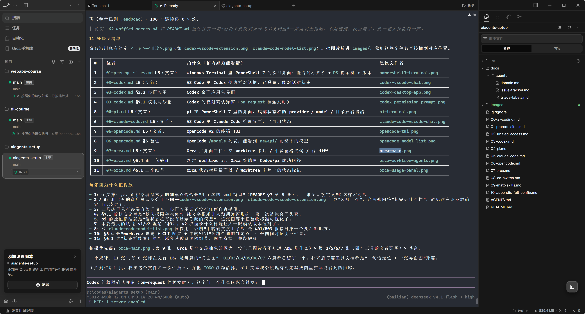

# Orca

**进阶工具（编排层）。** 开源的 AI 智能体开发环境（ADE, Agentic Development Environment）：在同一个窗口里，给每个任务开一个独立的 git worktree，每个 worktree 里跑一个 CLI 智能体（Codex / pi / Claude Code / OpenCode 都行），进度、diff、提交都集中在一处看。



---

# 1 它是什么、适合谁

- **定位**：它**不是又一个"接模型的客户端"**，而是管理智能体的**工作台**。真正干活的仍是前面四篇里的 CLI 智能体，Orca 负责给它们各自准备一个独立检出目录（git worktree）、一套终端窗格、一个浏览器页签和一套审查流程。
- **一句话原理**：**本篇通过 Orca 启动现有 CLI，沿用 CLI 的模型与凭据。** 它启动的是你本机**已经装好、已经配好**的 CLI 智能体，所以模型和密钥完全沿用 [统一接入](02-unified-access.md) 那一套，**本篇不需要你再填任何 Key**。
- **适合**：手上已经有 Codex / pi / Claude Code / OpenCode 在跑，并且经常遇到"想同时试两种方案""一个任务想丢给两个模型比一比""改到一半不敢切分支"这类问题的人。
- **优势**：一个任务一个 worktree，减少普通工作文件的并行冲突；不用 stash、不用来回切分支；同一个提示词可以发给三个智能体赛马，挑最好的那份 diff 合并；窗口分屏看进度，比开一堆终端窗口清楚。
- **代价**：它是图形应用（Electron），比纯终端工具吃内存；**每个 worktree 都常驻文件监听**，开太多会明显变慢（见第 8 节）。

> **先决条件提醒**：Orca 是"放大器"，不是"入门工具"。**请先把 [Codex](03-codex.md) 或 [pi](04-pi.md) 单独用顺**，再来上 Orca；否则出问题时你分不清是智能体的问题还是工作台的问题。

---

# 2 前置要求

| 项目 | 要求 | 检查方法 |
| --- | --- | --- |
| Windows | 10 / 11 **x64** | — |
| 环境变量 | `NEWAPI_KEY` 已设置（由被启动的 CLI 读取） | `-not [string]::IsNullOrWhiteSpace($env:NEWAPI_KEY)` → `True` |
| **Git** | 必装（worktree 是 Orca 的核心机制） | `git --version` |
| **至少一个 CLI 智能体** | 已装好并验证通过 | 见下表 |
| 内存 | 8 GB 起步，16 GB 更舒服 | — |

上表“至少一个 CLI 智能体”的“验证通过”，指先完成对应教程第 5 节的三层验证。下表仅用于短文本请求检查；在 Git 练习仓库中运行，并核对实际供应商及模型：

| 智能体 | 单独验证命令 | 教程 |
| --- | --- | --- |
| Codex | `codex exec -c 'model_provider="newapi"' --model gpt-6-sol "只回复两个字：可用"` | [Codex](03-codex.md) |
| pi | `pi -p --provider newapi --model deepseek-v4.1-flash "只回复两个字：可用"` | [pi](04-pi.md) |
| OpenCode | `opencode run --standalone --model newapi/deepseek-v4.1-flash "只回复两个字：可用"` | [OpenCode](05-opencode.md) |
| Claude Code | `claude -p --model 'deepseek-v4.1-flash[1M]' "只回复两个字：可用"`（先核对 NewAPI 地址） | [Claude Code](06-claude-code.md) |

> 密钥设置见 **[统一接入](02-unified-access.md)** 第 2 节。Git 见 [前置工具](01-prerequisites.md) 第 2 节。

---

# 3 安装

## 3.1 Windows：官方安装包（推荐）

到下载页取 Windows 安装包：

```PowerShell
Start-Process "https://www.onorca.dev/download"
```

或直接下最新版安装包（x64）：

```
https://github.com/stablyai/orca/releases/latest/download/orca-windows-setup.exe
```

装完后从开始菜单启动 **Orca**。

**首次启动会做三件事**，照它提示走即可：

1. 请求访问你的**用户目录**（它要在这里登记仓库路径）；
2. 询问是否**导入** `~/.claude`、`~/.codex` 与 Ghostty 的设置——不想让它读就选跳过，**不影响使用**；
3. 落到一个空界面，等你添加第一个仓库。

**装完先改一处设置**：`Settings → Terminal → Default shell` 选 **PowerShell**（默认可能是 CMD）。中文与按键体验会好很多。

## 3.2 Windows：Scoop（可选）

如果你的 Scoop 里已经有 `orca-ide` 这个包（我们机器上就是这么装的，包名是 `orca-ide`，当前版本 `1.4.209`）：

```PowerShell
scoop install orca-ide
scoop update orca-ide
```

## 3.3 macOS / Linux（备查）

```Bash
brew install --cask stablyai/orca/orca        # macOS
```

Linux 用 AppImage / `.deb` / `.rpm`，链接都在 <https://github.com/stablyai/orca/releases>。
注意：**Linux 上的命令行名字是 `orca-ide`**（避免和 GNOME 的 Orca 屏幕阅读器冲突），Windows / macOS 上就叫 `orca`。

## 3.4 注册命令行工具（`orca`）

Orca 自带一个 CLI，让脚本和**智能体自己**也能操作 Orca。在应用里打开：

```
Settings → General → Orca CLI → 注册（Register）
```

新开一个终端验证：

```PowerShell
orca status --json
```

预期输出里有 `"runtime": { "state": "ready", "reachable": true, ... }` 和 `appVersion`。

如果 Orca 应用没在运行，先让它起来：

```PowerShell
orca open --json
orca status --json
```

> 提示：Scoop 装的版本已经把 `orca` 放进 PATH；用官方安装包时，**必须先做这一步注册**，否则终端里会报 `command not found`。

---

# 4 接入 NewAPI：**这一步什么都不用做**

这是 Orca 和前面四篇最大的不同，也是最好的一点：

| 问题 | 答案 |
| --- | --- |
| Orca 的配置文件里要填中转地址和密钥吗？ | 本篇路线不用；它启动已配置的 CLI。其他账号管理功能不在此结论内 |
| 模型走哪个中转？ | 走**你那个 CLI 自己的配置**：Codex 看 `~/.codex/config.toml`，pi 看 `~/.pi/agent/models.json`，以此类推 |
| 密钥放在哪？ | **还是用户级环境变量** `NEWAPI_KEY` / `ANTHROPIC_AUTH_TOKEN`，见 [统一接入](02-unified-access.md) 第 2 节 |
| 要重新配置一遍吗？ | 通常沿用原配置；还要检查实际 home、环境变量、启动参数及权限是否一致 |

所以本篇的"配置"只有一句话：**保证你至少有一个智能体在终端里能跑通，然后让 Orca 去启动它。**

## 4.1 两个容易踩的坑

**坑一：不要用 Orca 的"添加账号"给 Codex/Claude 加账号。**

`Settings → Agents` 里有 Claude 和 Codex 的账号列表，还有热切换（hot-swap）功能——用于管理不同的官方账号。我们的 Codex 走的是 `~/.codex/config.toml` 里的中转配置，而 Orca 管理的**额外账号会使用独立的 home 目录**（`~/.local/share/orca/codex-accounts/<id>/home`），你的 `config.toml` 不会跟着过去。

> **原则**：用中转时，保持 **system default**（即真实的 `~/.codex` / `~/.claude`），不要 `Add account`。

**坑二：Orca 会给智能体预填"跳过权限确认"的参数。**

为了配合"worktree 是一次性目录"的思路，Orca 默认会给支持的 CLI 加上权限绕过参数（Claude Code 是 `--dangerously-skip-permissions`，Codex 是 `--dangerously-bypass-approvals-and-sandbox`）。**worktree 不是沙盒，这些参数可能取消 CLI 的审批或沙盒保护，影响范围不局限于这个目录**。

本教程建议先恢复客户端默认权限：

```
Settings → Agents → Agent Permissions → 选 Manual
```

改了之后，各智能体恢复用**它自己的**权限流程（也就是你在 [Codex](03-codex.md) / [Claude Code](06-claude-code.md) 里配的那套）。另外，如果你在 Orca 里手动改过某个智能体的启动参数，Orca 就会**不再动这个智能体**。

## 4.2 Orca 会往你的配置里写东西吗

会写**少量托管文件**，值得知道它们在哪：

| 位置 | 是什么 | 说明 |
| --- | --- | --- |
| `%USERPROFILE%\.orca\agent-hooks\` | 托管的状态上报脚本（如 `claude-hook.cmd`、`codex-hook.cmd`） | 作用是把"工作中 / 等待输入 / 已完成"报给 Orca 界面，靠 Orca 启动时注入的环境变量生效 |
| `%APPDATA%\orca\` | Orca 自己的数据目录（配置、日志、`orchestration.db` 等） | 应用自己维护，不要手改 |
| `~/.config/opencode/plugins/` | OpenCode 的状态插件（如 `orca-opencode-status`） | OpenCode 属于"自动接入 + 状态"档；同理 pi 也会被自动接入 |

这些托管内容可以在 `Settings → Agents → Agent status hooks` 一键**关掉**（关掉会移除托管的 hook，并不影响你**自己**写的 hooks；重新打开也不用手动重装，甚至不用重启 Orca）。命令行等价物：

```PowerShell
orca agent hooks status --json
orca agent hooks off --json
```

> **重要的是**：你仓库里已有的 `.claude/`、`.codex/` 配置（包括我们在 [附-完整配置](10-appendix-full-config.md) 里挂的那批 hooks）**照常生效**——Orca 会读取并沿用它们。智能体的记忆文件（`CLAUDE.md`、`AGENTS.md`）Orca 也**不动**，只在文件树里显示，方便你直接编辑。

---

# 5 验证（第一次使用必须做）

按“加仓库 → 建 worktree → 起智能体”验证；Orca 的版本与基线见 [README 第 4 节](README.md#4-版本基线与核验状态)。

## 5.1 添加仓库（Add Repo）

点侧边栏的 **Add Repo**，选一个**本地的 git 仓库目录**（建议先用一个已有提交的小项目练手）。前面的空 Git 练习仓库足以做 CLI 验证，但创建 worktree 需要可解析的提交；若要复用它，请先人工检查并提交练习文件，不需要推送。

Orca 会读这个仓库的 git 状态，并把**默认分支**记为 `base ref`——以后每个新 worktree 都从它拉出来。要改的话在仓库自己的设置里改。

## 5.2 创建 worktree

点仓库名旁边的 **+**，填一个任务名（例如 `fix-login-race`；**留空的话它会用海洋生物的名字命名**）。

- **start-from**：默认就是 base ref（`origin/main`），也可以选别的分支或某个 commit；
- 提交后对话框立刻关闭，创建在**后台**继续——你在侧边栏能看到进度行，失败会给你**重试（Retry）**。

Orca 会在自己的托管目录下执行真正的 `git worktree add`，检出分支并打开这个 worktree。

## 5.3 选智能体

新 worktree 里会自动开一个终端，终端上有个**智能体下拉框**：选 Codex、pi、Claude Code 或 OpenCode。

Orca 会用**正确的工作目录（cwd = 该 worktree）**启动那个 CLI。

## 5.4 跑一句验证

在这个终端里，按你选的智能体输入对应的话（也可以直接把下面这句丢给智能体）：

```
只回复两个字：可用
```

收到正常回答只说明本次请求成功。还要在界面确认实际模型与供应商，并验证读取文件和只读命令。先在该 worktree 的 PowerShell 7 终端中运行：

```PowerShell
Get-Location # 确认这里是刚创建的 worktree
$probeFile = 'orca-check-' + [guid]::NewGuid().ToString('N') + '.txt'
$probeText = 'check-' + [guid]::NewGuid().ToString('N')
Set-Content -LiteralPath $probeFile -Value $probeText -Encoding utf8 -ErrorAction Stop
Write-Output "自行核对，不发给模型：$probeText"
Write-Output "给模型的提示：读取当前目录的 $probeFile，原样报告其中的文本；实际执行 git status --short 并报告输出。不要创建、修改或删除任何文件。"
git status --short
```

只把最后生成的“给模型的提示”交给智能体，不要粘贴核对文本或整段终端输出。成功标准：工具记录显示读取了实际文件名并执行了命令，文本与自己保存的随机文本一致，Git 输出包含 `?? orca-check-<实际随机后缀>.txt`。如果人工执行时也看不到该文件，先检查忽略规则，使用没有忽略该测试文件的练习仓库。

这里使用全新文件，避免已提交的 `agent-check.txt` 在 worktree 中被识别为已跟踪文件。确认智能体的工作目录确实为新 worktree；回答“可用”本身不证明隔离或工具能力。

## 5.5 试一次"三个智能体赛马"（官方推荐的第一课）

1. 重复 5.2～5.3 两次，做出三个 worktree：`fix-login-race`、`fix-login-race-2`、`fix-login-race-3`；
2. 分别挂上不同的智能体（例如 Claude Code / Codex / OpenCode）；
3. **把同一段提示词贴进三个终端**；
4. 把某个 worktree 的标签页**拖到窗格的右边或下边**，就能分屏同时看三个智能体干活；
5. 等它们停下来，打开各自的 diff，挑一份最接近的合并（见第 6 节）。

---

# 6 日常用法

| 你想做的事 | 怎么做 |
| --- | --- |
| 加一个新仓库 | 侧边栏 **Add Repo** |
| 新任务 | 仓库名旁 **+** → 填任务名 → 选 start-from ref |
| 让任务从某个分支/提交开始 | 建 worktree 时改 **Branch from** |
| 换个智能体跑 | 用终端上的智能体下拉框开新终端 |
| 同时看几个智能体 | 把标签页拖到窗格边缘分屏 |
| 看某个任务改了什么 | 打开该 worktree 的 **diff 视图**（对比 start-from ref） |
| 给 diff 写意见并让智能体改 | **Annotate AI Diff**：在 diff 上留行内评论，直接发回给智能体 |
| 提交 / 推代码 / 开 PR | 都在 Orca 里做，见 [Commit & push](https://www.onorca.dev/docs/review/commit-push) |
| 干完清理 | 先保存或合并改动，再检查应用的 worktree 与分支清理选项；不要把删除等同于可恢复归档 |
| 换默认智能体 | `Settings → Agents` |
| 换主题 / 终端字体 | `Settings → Appearance` / `Settings → Terminal` |
| 让它别让电脑睡 | 状态栏 **Caffeinate**（咖啡杯）或 `Settings → Agents → Keep computer awake` |

## 6.1 值得早点知道的三个细节

1. **worktree 是干净检出**：未跟踪或被忽略的依赖、缓存、本地密钥文件通常不在，需要安装、复制或配置共享——见 7.1，这是新手最容易卡住的地方。
2. **每个 worktree 有独立工作目录和 HEAD**，通常使用不同分支，但共享对象库、部分引用及默认 Git 配置。Orca 的清理操作可能同时删除分支，操作前检查选项、未提交改动和未合并提交；参见 [Git worktree 说明](https://git-scm.com/docs/git-worktree#_refs)。
3. **状态栏能看到用量**：如果你的智能体是官方订阅（Claude / Codex），Orca 会读本地用量状态，把"离限流还有多远"显示出来；点它能看到各供应商的用量面板。走中转的用量请看中转后台。

---

# 7 进阶

## 7.1 让新 worktree 不缺依赖和密钥文件（Windows 上最实用）

新 worktree 不包含主检出中未跟踪或被忽略的 `node_modules`、`.env`。优先为可能修改依赖的任务独立安装；对于确认依赖一致的任务，可以使用 [Orca 的共享与复制功能](https://www.onorca.dev/docs/model/worktrees)：

| 办法 | 适合什么 | 怎么配 |
| --- | --- | --- |
| **Worktree Shared Paths** | 每台机器自己的偏好 | `Settings → Repository → Worktree Shared Paths` |
| **`orca.yaml`**（进仓库、团队共享） | 大而可重建的目录，如 `node_modules`、`.cache` | 在仓库根目录写 `worktree.sharedDirectories` |
| **`.worktreeinclude`**（进仓库） | 要**每个 worktree 各自一份**的文件，如 `.env`、`.vscode/settings.json` | 在仓库根目录列出来 |

```yaml
# orca.yaml（片段：合并到已有文件；仅适用于依赖一致且不会重新安装的任务）
worktree:
  sharedDirectories:
    - node_modules
    - .cache
```

```
# .worktreeinclude（放在仓库根目录）—— 这些是“复制”而不是“共享”
.env
.env.local
.vscode/settings.json
```

规则提醒：

- `sharedDirectories` 是**共享/软链**，条目必须是**主检出里真实存在且被 gitignore 的目录**；
- `.worktreeinclude` 是**复制**（每个 worktree 自己一份），只支持**字面路径**，不支持通配符；
- 两个文件里的路径如果被 git 跟踪、不存在、或者没被 gitignore，会被**跳过**。

> **共享有条件**：依赖和锁文件一致、且并行任务不会重装依赖时，共享 `node_modules` 可节省空间。若任务会改依赖，应在每个 worktree 独立安装。共享缓存也可能互相影响。`.env` 可按需复制，但仍是密钥副本；`.worktreeinclude` 列的是路径，不要把文件内容提交进仓库。已有 `orca.yaml` 或 `.worktreeinclude` 先备份合并。

## 7.2 自动跑安装命令（Worktree setup hooks）

`Settings → Repository → Hooks` 里可以配"worktree 创建后自动执行"的命令，例如：

```
pnpm install
```

前提是已安装 pnpm，并且这个 worktree 使用独立依赖目录。**不要在共享 `node_modules` 的工作区无条件运行安装 hook**，它可能修改其他并行任务的依赖。创建后检查 hook 日志与退出状态，失败时先排查再启动任务。命令行里也能控制单次行为（`--setup run|skip|inherit`）：

```PowerShell
orca worktree create --name fix-login --agent codex --setup run --json
```

## 7.3 Orca CLI：让脚本或智能体反过来操作 Orca

注册之后（3.4），`orca` 就是个很顺手的自动化入口。常用命令：

| 目的 | 命令 |
| --- | --- |
| 看运行时状态 | `orca status --json` |
| 列出所有 worktree | `orca worktree ps --json` |
| 新建 worktree 并直接起智能体 | `orca worktree create --name review-api --agent codex --prompt "总结这次改动" --json` |
| 我的仓库有哪些 | `orca repo list --json` |
| 列出 / 读取终端 | `orca terminal list --json`、`orca terminal read --terminal <handle> --json` |
| 给终端发一行输入 | `orca terminal send --terminal <handle> --text "continue" --enter --json` |
| 等终端安静下来 | `orca terminal wait --terminal <handle> --for tui-idle --timeout-ms 300000 --json` |
| 打开文件 / 看 diff | `orca file open src/App.tsx`、`orca file diff src/App.tsx --staged` |
| 全文检索所有智能体会话 | `orca search --query "rate limit" --scope conversation --limit 20 --json` |
| 给 worktree 留一句进度 | `orca worktree set --worktree active --comment "复现了失败，正在改 token 刷新" --json` |

编写脚本时的两条经验（官方建议）：**能用 `--json` 就用**；**优先用选择器**（`active`、`path:...`、`branch:...`、`id:...`）而不是猜 UI 上的名字。

## 7.4 技能（Skills）与 MCP

Orca 提供一批"技能"给智能体安装，装了之后**智能体自己就能开 worktree、派活给别的智能体**：

```PowerShell
npx skills add https://github.com/stablyai/orca --skill orca-cli --global
npx skills add https://github.com/stablyai/orca --skill orchestration --global
```

没有图形界面的机器（SSH / 容器 / `orca serve`）用本地封装：

```PowerShell
orca skills list
orca skills install --skill orca-cli --skill orchestration
orca skills update --all
```

| 技能 | 干什么 |
| --- | --- |
| `orca-cli` | worktree、终端、文件、自动化、内置浏览器 |
| `orchestration` | 多智能体编排：带监督的任务分派、消息、决策关卡 |
| `computer-use` | 通过无障碍树操作桌面应用（GUI 自动化） |
| `orca-linear` / `orca-emulator` 等 | 线性工单、iOS 模拟器等专项 |

> 默认会装 `orca-cli`、`computer-use`、`orchestration` 三个。**注意**：这等于给智能体开了"操作你的 Orca"的权限（开 worktree、往终端里发命令）——想清楚再装。

Orca 也支持 MCP：`Settings → Integrations → MCP` 注册后，工具会出现在支持 MCP 的智能体里。

> 上面这些是 Orca 自带的“操作 Orca”技能。技能本身的机制、以及 Matt Pocock 那套 25 个工程流程技能（与本仓库其它工具通用），见 [Matt Skills](09-matt-skills.md)。

## 7.5 远程与手机（按需）

- **SSH worktree**：把远端机器当工作目录，本地界面操作（要求远端有 Node 和网络；Linux 上还需要 `make` / `g++` / `python3` 这类工具链）。
- **Remote Orca Server**：`orca serve` 在没有图形界面的机器上起运行时，再用别的设备连上去。
- **手机伴侣**：iOS / Android，用来在离开电脑时看进展、回复智能体的提问。

这三项都属于"用顺了再说"，文档见 <https://www.onorca.dev/docs/ways-to-run>。

---

# 8 常见问题

| 现象 | 可能原因、检查顺序与下一步 |
| --- | --- |
| 终端里 `orca: command not found` | 没注册 CLI：`Settings → General → Orca CLI`。macOS 上注册后要把 `~/.local/bin` 加进 `PATH` |
| `orca status` 连不上 | Orca 应用没在运行：先 `orca open --json`，再 `orca status --json` |
| **智能体起不来** | 先**在普通终端里手动跑那个 CLI**。手动也失败时先按 [统一接入](02-unified-access.md) 第 6 节排查环境、网络、配置和服务端；手动能跑时检查 Orca 的环境继承、home 和启动参数，再检查 `Settings → Agents` 里这个 CLI 是否被识别/启用，或点标签页上的 **Restart** |
| Orca 里看不到某个智能体 | 该 CLI 不在它启动时用的 PATH 里，或没在 `Settings → Agents` 里启用 |
| **新建 worktree 失败** | ① start-from ref 没拉到：在仓库终端跑 `git fetch origin`；② 目标分支已经有 worktree 占着：复用现有 worktree 或换个分支名，勿为排错直接删除未完成的工作 |
| 新 worktree 里没有 `node_modules` / `.env` | 正常，worktree 是干净检出：按 7.1 配共享目录与 `.worktreeinclude` |
| 智能体一上来就乱跑命令不问你 | Orca 预填了权限绕过参数：`Settings → Agents → Agent Permissions` 改 **Manual**（见 4.1） |
| Orca 启动的 Codex 不走中转 | 多半是用 `Add account` 加了"额外账号"：换成 **system default**（见 4.1） |
| diff 视图不对 / 卡住 | 点 diff 工具栏上的**刷新**图标；你在外部终端做过 rebase / reset 时需要重新读 |
| 越用越卡、内存飙高 | 关掉不用的 worktree（**每个都常驻文件监听**）；分屏里开着一堆浏览器页签最吃内存 |
| 中文乱码 | 把默认 shell 改成 PowerShell：`Settings → Terminal → Default shell`；系统用 Windows Terminal |
| 远程 SSH 连上了但终端起不来 | 远端缺 Node 或网络（首次要装中继）；Linux 上补 `make` / `g++` / `python3` 后重连 |
| 想彻底重来 | 先在 Orca 设置里关闭 Agent status hooks，保存任务改动并处理托管 worktree，再退出应用并按第 9 节卸载 |

> 出问题时还有一个通用动作：`Help → Open Logs` 打开日志目录；提 issue 时把日志一起附上。

---

# 9 升级与卸载

**升级**：Orca 默认**自动更新**（稳定通道）。手动检查在 `Settings → General → Updates`。

| 想干什么 | 怎么点 |
| --- | --- |
| 只要最新稳定版 | 直接点 **Check for Updates** |
| 尝鲜版（RC） | **Shift + 点击** Check for Updates |
| perf 前缀版 | **Ctrl + 点击**（Windows / Linux） |
| 回退到旧版 | 到 [GitHub Releases](https://github.com/stablyai/orca/releases) 下旧版安装；Orca 不会强制降级你的 worktree 数据 |

**卸载**：

```PowerShell
scoop uninstall orca-ide        # Scoop 安装的
```

官方安装包装的，用 Windows「添加或删除程序」卸载。

**卸载后残留**（想彻底清理再手动删）：

| 位置 | 内容 |
| --- | --- |
| `%APPDATA%\orca` | 应用数据、日志、编排数据库 |
| `%USERPROFILE%\.orca` | 托管 hook 脚本 |
| 你项目旁边的 worktree 目录 | Orca 托管目录下为每个任务建的检出（**删前确认改动都合并了**） |

> worktree 的工作文件独立，但仓库对象、引用和部分配置共享；创建和清理 worktree 会修改 Git 管理信息。不要直接删除托管目录来代替应用或 Git 的清理操作，先确认未提交改动、分支与未合并提交已保留。

---

# 10 参考资料

1. 官方文档：<https://www.onorca.dev/docs>
2. 手把手第一课（3 个智能体并行）：<https://www.onorca.dev/docs/first-session>
3. worktree 模型与共享目录：<https://www.onorca.dev/docs/model/worktrees>
4. 支持的智能体清单：<https://www.onorca.dev/docs/agents/supported>
5. Orca CLI 参考：<https://www.onorca.dev/docs/cli/reference>
6. 下载 / 全部发行版：<https://www.onorca.dev/download> ｜ <https://github.com/stablyai/orca/releases>
7. 源码与中文说明：<https://github.com/stablyai/orca>
8. 统一接入与模型清单：见本仓库 [统一接入](02-unified-access.md)
9. **实时查看可用模型与价格**：<https://newapi.ttxs.site/pricing>
