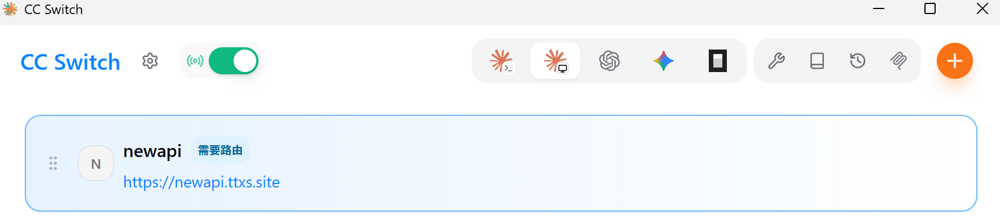
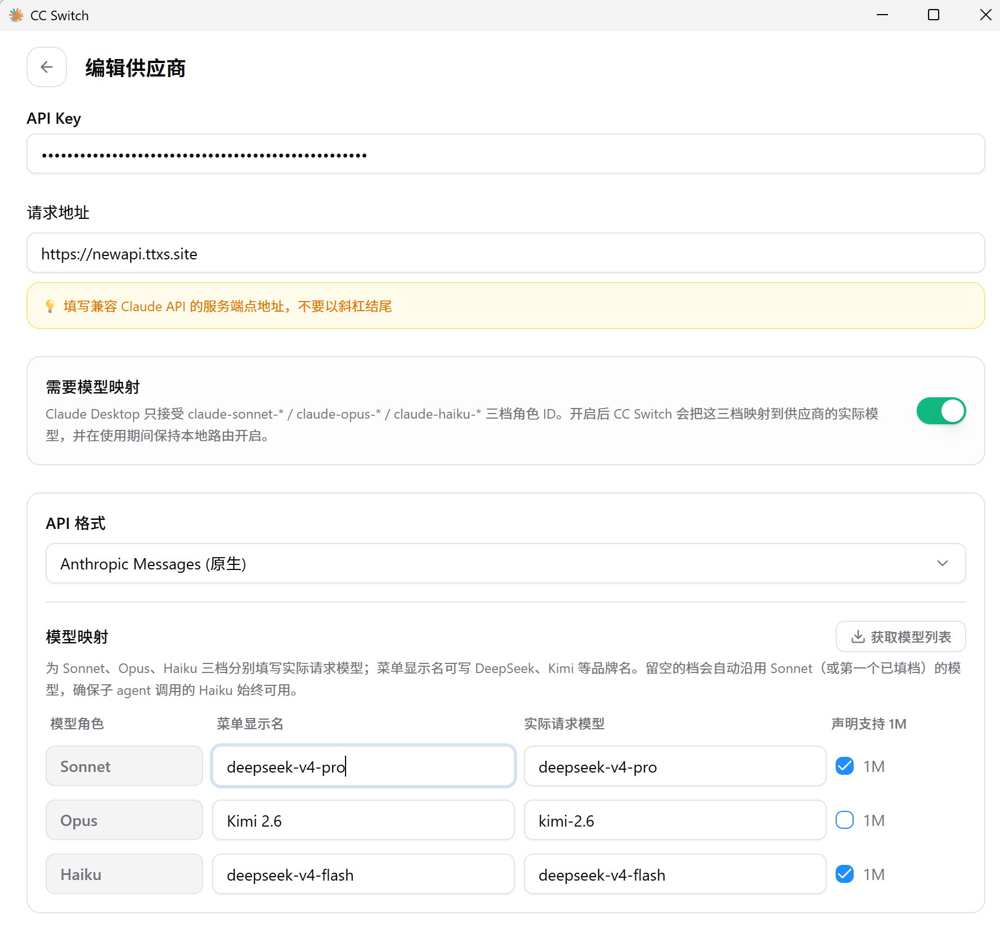

# cc-switch（进阶：供应商统一管理）

**什么时候看这篇**：当你已经把 [Codex](03-codex.md) / [pi](04-pi.md) / [Claude Code](05-claude-code.md) / [OpenCode](06-opencode.md) 用起来了，开始遇到下面这些需求时——

- 手上有**多个**模型供应商（我们的 NewAPI + 别的中转 + 官方订阅），要频繁切换；
- 想知道**每个工具到底花了多少额度**；
- 想让"主供应商挂了自动切备用"；
- 想在本机开一个**统一入口**，让所有工具都往同一个地址发请求。

**如果以上都不需要**（只用我们的 NewAPI 一家），那就**不用装它**——本文档的主线方案（环境变量 + 复制配置）已经够用，少一个工具就少一个故障点。

---

# 1 它是什么

CC Switch 是一个开源的**桌面应用**，把"AI 编程工具的供应商配置"从每个项目/终端里抽出来，集中管理：

| 能力 | 说明 |
| --- | --- |
| 供应商切换 | 一个界面管理多个工具的供应商配置，可点"启用"写回对应工具的配置文件；Claude Code 支持热切换 |
| 本地路由 | 在本机起一个可控端点，各工具统一往它发请求；内置熔断、健康监控与故障转移队列 |
| 协议转换 | 自动把不同 API 格式转换成目标工具要求的格式 |
| 用量统计 | 统一查看各供应商/各工具的消耗 |
| 扩展管理 | MCP 服务器、Skills、Prompt 模板、会话配置的集中管理 |

支持的工具有 Claude Code、Codex、OpenCode、Gemini CLI 等（具体清单以官网当前版本为准）。



---

# 2 安装

官网（Windows 版下载）：<https://ccswitch.io/zh/>

> 网上存在多个同名的"CC Switch 官网"站点，认准官网页面里的 GitHub 仓库链接与版本号；下载后建议核对一下文件名与版本。

---

# 3 基本用法（概念层面）

1. **添加供应商**：点 `+`，可以选预设供应商，也可以手动填 OpenAI 兼容接口（我们的就是这种）：
   - 名称：`newapi`
   - 接口地址：`https://newapi.ttxs.site/v1`
   - 密钥：`sk-你的Key`
2. **启用**：在供应商卡片上点"启用"，CC Switch 会去改写对应工具的配置文件。
3. **托盘切换**：v3.13 之后托盘菜单按应用分组，右键托盘图标就能切到某个工具的某个供应商。

**添加/编辑供应商的界面长这样**（Claude Code 得把 Sonnet / Opus / Haiku 三档映射到实际模型，这也是下面第 4.2 节那个坑的根源）：



---

# 4 ⚠️ 两个必须知道的坑

## 4.1 它会**改你的配置文件**

CC Switch 的工作原理就是替你写 `~/.claude/settings.json`、`~/.codex/config.toml` 这类文件。所以：

- **用之前先备份**：把 `%USERPROFILE%\.claude`、`%USERPROFILE%\.codex`、`%USERPROFILE%\.pi\agent`、`%USERPROFILE%\.config\opencode` 复制一份留底；
- 用完之后**回头检查**：我们教程里那些配置项（尤其 `ANTHROPIC_BASE_URL`、模型档位映射、`env_key`）是否还在。

## 4.2 开启"本地路由"可能会删掉 `ANTHROPIC_MODEL`

已知问题（cc-switch issue #6889）：开启本地路由后，`~/.claude/settings.json` 里的 **`ANTHROPIC_MODEL` 会被删除**。后果是 Claude Code 不知道用哪个模型，回退到内部默认值 `default[1M]`，请求直接失败（表现为报错或一直转圈）。

**处理办法**：开完路由后打开 `%USERPROFILE%\.claude\settings.json`，确认 `env` 块里这几项还在：

```json
"ANTHROPIC_MODEL": "deepseek-v4.1-flash[1M]",
"ANTHROPIC_DEFAULT_FABLE_MODEL": "glm-5.3-flash",
"ANTHROPIC_DEFAULT_OPUS_MODEL": "claude-opus-5-5[1M]",
"ANTHROPIC_DEFAULT_SONNET_MODEL": "deepseek-v4.1-flash[1M]",
"ANTHROPIC_DEFAULT_HAIKU_MODEL": "gpt-6-luna"
```

少了的按 [Claude Code](05-claude-code.md) 第 4 节补回去。

---

# 5 和本文档主线方案的关系

| | 主线方案（本文档） | cc-switch |
| --- | --- | --- |
| 配置方式 | 手写配置文件 + 环境变量，一次性配好 | 图形界面点选，自动改写配置文件 |
| 供应商数量 | 一家（NewAPI） | 多家，随时切换 |
| 依赖 | 无（只有四个 CLI） | 多一个常驻桌面应用 |
| 适合谁 | 初学者、单一供应商 | 老手、多供应商、要看用量 |

**建议**：先用主线方案把四个工具都用熟（至少两周），再决定要不要上 cc-switch。

---

# 6 参考资料

1. CC Switch 官网：<https://ccswitch.io/zh/>
2. 供应商切换教程：<https://cc-switch.cc/tutorials/provider-switching>
3. 已知问题（本地路由删除 ANTHROPIC_MODEL）：<https://github.com/farion1231/cc-switch/issues/6889>
4. 本仓库主线方案：[统一接入](02-unified-access.md)